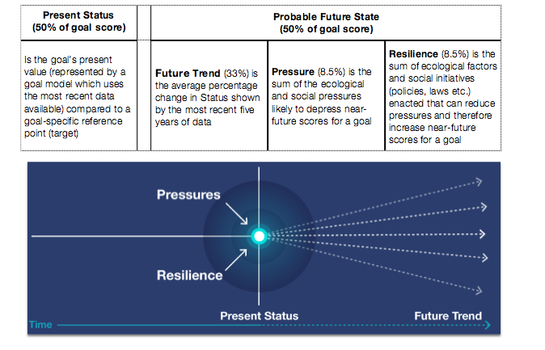

**How is the Index calculated?**

For each goal, models are developed to best represent the philosophy of that goal using the best available data at the scale of study. The present status that is calculated individually for each goal forms half of that goal’s score.  The other half, called likely future status, is based on three things:

•	the trend, which is the average rate of change for status during the most recent five years

•	the cumulative pressures that will harm future benefits

•	the cumulative resilience actions that can reduce pressures and maintain or raise future benefits (for example treaties, laws, enforcement, habitat protection)



The current status of each goal is determined by comparing the most recent measure of the goal with a goal-specific sustainable reference point.  The reference point may be a target value at some time in the past, comparison with some other location, a target previously established by a treaty or other agreement, or – best of all – a target determined by an accepted input-output equation (also called a production function).

The trend is calculated as the slope of the change in status based on recent data. As such, the trend calculation is not trying to predict the future but only to indicate likely condition (sustainability) based on a linear relationship.
Pressures and resilience are ultimately important for scores, but they have a smaller contribution to the overall scores because we can only approximate their effects. Individual pressures are ranked for their importance to different goals based on published studies and expert opinion. Resilience actions are the best way to improve a score, because they can reduce pressures, protect ocean habitats and species, improve status, and optimize benefits to people.
Status, trend, likely future status, pressures, and resilience are called ‘dimensions’ within the Ocean Health Index framework.
