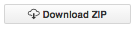

# Introduction

The Ocean Health Index [intro here]

Intro to WebApps concept and overview of lab exercise
 - study areas and regions

# Instructions

You access an existing WebApp and modify it locally on your computer to complete the assignment. You will need to install R (and preferably RStudio) to complete the assignment. 

**Setup steps:**

1. Create a folder called `**ESM_270**` in your home directory so that the R scripts will run smoothly. This folder will have the following filepath:
    - **Windows**: `Users\[User]\Documents\ESM_270\`
    - **Mac**: `Users/[User]/ESM_270/`

2. **R**: Download and install the current version of R from [cran.r-project.org](http://cran.r-project.org/). 

3. **RStudio**: Download and install the current version of RStudio from [rstudio.com](www.rstudio.com). 

4. Choose a coastal country or territory that has a WebApp using the list available at [ohi-science.org/subcountry](). The WebApp you choose must have a green `build | passing` indicator associated with its study area. 
    - click the three-letter code in the '*Repo*' column to explore the WebApp of that study area. 
    - click the date in the '*Last Mod*' column to explore the GitHub repository of that study area. 

5. Click the '*Download ZIP*' button on the main page of the repository  
    

6. unzip the downloaded *.zip* folder and save in your `ESM_270` folder. 
  
7. Open RStudio follow the instructions below. 


```{r}
# in your R Console, 
key = 'xxx'

```

```{r}

# paste the following into your console:

setwd('~/ESM_270/

summary(cars)
```

You can also embed plots, for example:

```{r, echo=FALSE}
plot(cars)
```

Note that the `echo = FALSE` parameter was added to the code chunk to prevent printing of the R code that generated the plot.
