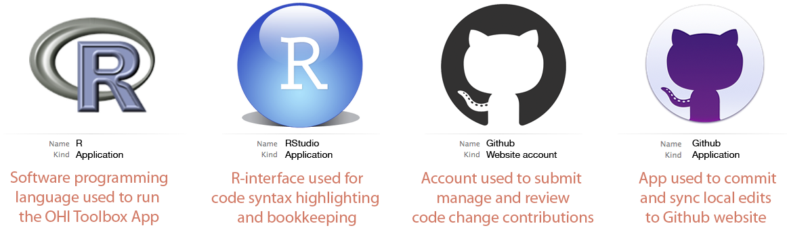
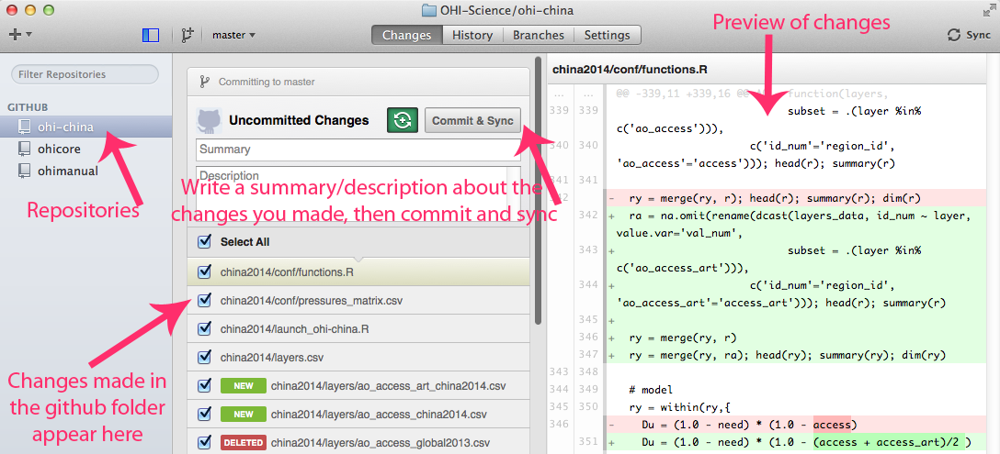

   

## OHI and GitHub 
The Ocean Health Index (OHI) Toolbox is written in [R](http://cran.r-project.org/) and uses [GitHub](http://github.com), an [open-source development platform](http://en.wikipedia.org/wiki/GitHub) to develop and share software and data. GitHub has powerful versioning capabilities, which allow changes to be archived and tracked by each user. This is incredibly useful to not only document what work has been done, but how it differs from work done in the past, and who is responsible for the changes. GitHub enables easy collaboration with others, including the OHI team. 
  
OHI has several repositories ('repos') where data and code are stored. From the [GitHub glossary](https://help.github.com/articles/github-glossary#repository): 

> A repository is the most basic element of GitHub. They're easiest to imagine as a project's folder. A repository contains all of the project files (including documentation), and stores each file's revision history. Repositories can have multiple collaborators and can be either public or private.

[OHI-Science](https://github.com/OHI-Science) is the 'owner' of OHI repositories, and individual users contribute to these repositories when they have permission. This simple example illustrates GitHub's collaborative workflow with the `ohi-israel` repo owned by `OHI-Science`:

> > > > > 

### OHI regional assessments and GitHub
We recommend that groups interested in conducting OHI assessments do so through GitHub. This will enable collaboration and transparency, and will provide access to the latest developments in the Toolbox software. To get started, follow the steps below. The OHI team will create a repository for your regional assessment.  

It is also possible to conduct a regional assessment without GitHub. We do not recommend this because it is more difficult for you to track progress and decisions, and for us to help or advise you. However, if this is preferable, see the instructions [here](https://github.com/OHI-Science/ohimanual/blob/master/tutorials/accessing_a_repo_without_GitHub/accessing_a_repo_without_GitHub.md). We can always get your filesystem onto GitHub later. 
  
## Getting started

### What is needed?



### Install R and RStudio
Make sure you have the most current version of [R and RStudio](https://github.com/OHI-Science/ohimanual/blob/master/tutorials/software_for_OHI/software_for_OHI.md). 

### Create a GitHub account
To get started, [signup](http://github.com) for a GitHub account, and provide your username to bbest@nceas.ucsb.edu or lowndes@nceas.ucsb.edu so you can access your ohi-[assessment] repository.

### Install *git* Application
*git* is required to work behind the scenes on your computer. [Download](http://git-scm.com/downloads) and install *git*. (Here are a few [tips](https://github.com/OHI-Science/ohiprep/wiki/Setup#git)).  
  
You will then need to set up your Git Identity, which identifies you with any changes made. You will use the command line: 

* **Mac**: launch the Terminal application (Applications > Utilities > Terminal)
* **Windows**: go to command line in Windows (Start > Run > cmd)  
  
Substitute your GitHub user information with the user John Doe:

```
git config --global user.name jdoe
```
and then: 
```
git config --global user.email johndoe@example.com
```

You can check settings with the following:

```
git config --list
```

Quit the Terminal after typing:
```
exit
```

### Create your ohi-[assessment] repo
Contact the OHI team (bbest@nceas.ucsb.edu or lowndes@nceas.ucsb.edu) to create a repository for your group. The repository will be stored on github.com and called `OHI-Science/ohi-[assessment]`: for example, `github.com/OHI-Science/ohi-israel`.

### Clone your repo to your computer
Once there is a repository for your OHI regional assessment called `OHI-Science/ohi-[assessment]`, you can decide whether you will clone and work directly from that repository  or from a forked repository. There are benefits to both approaches:

* Working directly from the repository is simplest: you can make changes on your local computer and push them directly to the online repository, as in the figure above. You do not need to send pull requests; simply clone from `OHI-Science/ohi-[assessment]` (see [Cloning options](https://github.com/OHI-Science/ohimanual/blob/master/tutorials/accessing_a_repo/accessing_a_repo.md#cloning-options)) and push/pull from there.
* [Forking](https://help.github.com/articles/fork-a-repo) a repository is best when you have multiple collaborators working on the same repository. This would allow you to commit changes to your local version, push commits up to github for offsite archiving, and eventually make a pull request to have those changes merged back to `ohi-science/ohi-[assessment]` while your collaborators do the same. This is a good way for someone who is not in the core team of the assessment to contribute comments.

\*\* With either approach, we recommend creating a folder called `github` in your root directory so that you can clone the repository to this file path: `~/github/ohi-[assessment]`. This will make collaborating much simpler since everyone will work with the same file path.


#### Cloning options
There are several options to clone the ohi-[assessment] repository to your local machine:

1. The GitHub App for [Mac](https://mac.github.com/) or [Windows](https://windows.github.com/). After installing the GitHub App, click `Clone in Desktop` button from the online repository (see the *Getting started guide* on a [Mac](https://mac.github.com/help.html) and [Windows](https://windows.github.com/help.html))
2. [The command line](https://help.github.com/articles/fork-a-repo#keep-your-fork-synced).
3. [RStudio](https://github.com/OHI-Science/ohiprep/wiki/Setup#rstudio). This is best after the initial clone, since RStudio occassionally has trouble with setting the username / password.


## Working locally
All of the files available from the online server repository `https://github.com/OHI-Science/ohi-[assessment]` are now cloned on your local computer, in the location you specified (we recommend cloning the repository to this file path: `~/github/ohi-[assessment]`). 

> 

You will work on your computer to change the files in `~/github/ohi-[assessment]` to reflect the desired modifications your team has identified for your regional assessment. 
All changes within this folder will be tracked by GitHub when you [commit](https://github.com/OHI-Science/ohimanual/blob/master/tutorials/accessing_a_repo/accessing_a_repo.md#committing-locally) these changes, *even if you make these changes outside of R or RStudio*. This means that you can delete or paste files in the Mac Finder or Windows Explorer, edit `layers.csv` and `goals.csv` in Excel or a text editor, and modify `functions.r` in RStudio, and commit all these changes to GitHub to track the changes you make.

## Committing and pushing changes locally

Committing and pushing changes can be done using either RStudio or the Github App

### Using RStudio to commit changes
Launch your `ohi-[assessment]` project in RStudio by double-clicking the `ohi-[assessment].Rproj` file. From RStudio, Commit locally, associating a message with each set of changes.

> 

### Using RStudio to push commits to GitHub ohi-[assessment] repository
When you modify or add a file, the file will appear in the 'Git' window. In the example below, the file `test.R` was created. 

1. Clicking the 'Staged' box and the 'Commit' button opens a new window where you can review changes. 
2. Type a commit message that is informative to the changes you've made. 
  - Note 1: there will often be multiple files 'staged' at the same time, and so the same commit message will be associated with all of the updated files. It is best to commit changes often with informative commit messages. 
  - Note 2: clicking on a staged file will identify additions and deletions within that file for your review
3. Click 'Commit' to commit the changes and the commit message
4. Pull any changes that have been made to the online repo. This is important to ensure there are no conflicts with updating the online repo. See [Keeping synchronized](https://github.com/OHI-Science/ohimanual/blob/master/tutorials/accessing_a_repo/accessing_a_repo.md#keeping-syncronized). 
5. Push your committed changes to the online server at `github.com/OHI-Science/ohi-[assessment]`. Your changes are now visable online.  
  
  
> 

### Using Github App to push commits to GitHub ohi-[assessment] repository
The Github App can also be used to commit and sync any changes made locally in the github folder. To do so, write a summary and description in the respective message bars in the Github App window, then click on commit and sync.




## Keeping syncronized
Always pull before pushing commits. 

### Pull commits to get changes from anyone else.


#### More Information

* [presentation: Reproducible science with the Ocean Health Index](http://bbest.github.io/talks/2014-06_OHI-repro-sci/#1)
* [wiki: Using GitHub](https://github.com/OHI-Science/ohiprep/wiki/Using-GitHub)
* see www.oceanhealthindex.org and ohi-science.org for more information and resources.  

