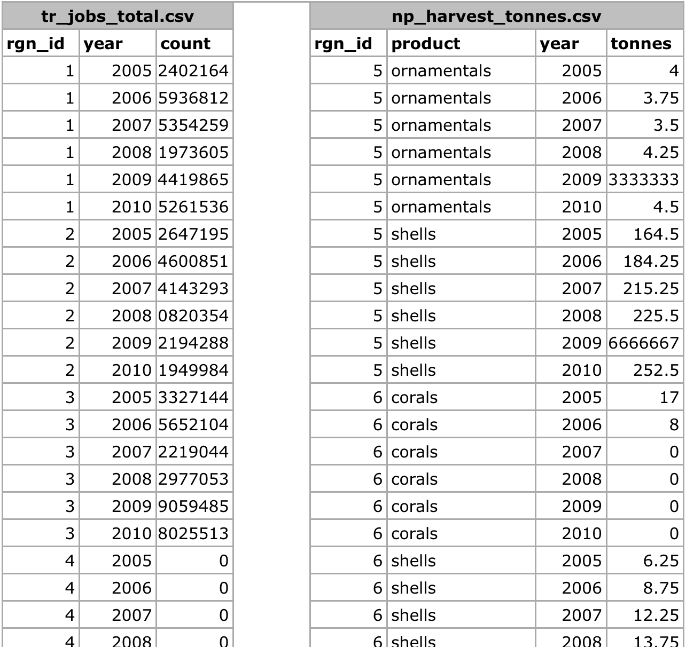

## Formatting Data for the Toolbox

### Introduction

The Ocean Health Index Toolbox App is designed to work in the programming language **R** using input data stored in text-based .csv files (.csv stands for 'comma-separated value'; these files can be opened as a spreadsheet using Microsoft Excel or similar programs). Data layers (data input) each have their own .csv file that are combined within the Toolbox in model calculations. These data layers are used for calculating goal scores, meaning that they are inputs for status, trend, pressures, and resilience. In the global analysis, there were over 100 data layer files included, and there will be as many in regional applications, no matter what the spatial scale. This document describes and provides examples of how to format data for the Toolbox App.

Ocean Health Index goal scores are calculated at the scale of the reporting unit, which is called a ‘**region**’ and then combined using a weighted average to produce the score for the overall area assessed, called a ‘**study area**’. The OHI Toolbox App expects each data file to be in a specific format, with data available for every region within the study area, with data organized in 'long' format (as few columns as possible). In order to calculate trend, input data must be available as a time series for at least 5 recent years (and the longer the time series the better, as this can be used in setting temporal reference points).

In the example below, there are two data layers files (tr_jobs_total.csv and np_harvest_tonnes.csv) that have data for four and two regions respectively (1-4, and 5-6). In this example, the two data layers are appropriate for status calculations with the Toolbox because:

1. At least five years of data are available, 
2. There are no data gaps
3. Data are presented in 'long' or 'narrow' format (not 'wide' format).

**Example of data in the appropriate format:**

It is important that data prepared for the Toolbox App have no missing values or 'gaps'. Data gaps can occur in two main ways: 1) **temporal gaps**: when several years in a time series in a single region have missing data and 2) **spatial gaps**: when all years for a region have missing data (and therefore the whole region is 'missing' for that data layer). How these gaps are filled will depend on the data and regions themselves, and requires a thoughtful decision to most reasonably fill the gap. Each data layer can be gapfilled using different approaches. Some data layers will require both temporal and spatial gapfilling.

If there is insufficient data, see the sections below to see examples of gapfilling. For more information about types of gapfilling, see the supplementary  methods used in the 2013 global assessment, available on http://ohi-science.org/.

### Temporal gapfilling

Temporal gaps are when some data are available for a region, but there are missing years. The Toolbox requires data for each year for every region.

Many times, creating a linear model is the best way to estimate data and fill temporal gaps. If data do not fit a linear framework, other models may be fit to help with gapfilling. Here we give an example assuming linearity.

Using a linear model can be done in most programming languages using specific functions, but here we show this step-by-step using functions in Excel for Region A.

**Steps to temporally gapfill data (assumes linearity):**

**1. Calculate the slope for each region**

The first step is to calculate the **slope** of the line that is fitted through the available data points. This can be done in excel using the SLOPE(known_y's,known_x's) function as highlighted in the figure below. In this case, the x-axis is in years (2005, 2006, etc...), the y-axis is in 'tourist_count', and the excel function automatically plots and fits a line through the known values (177.14 in 2005, 212.99 in 2008, and 228.81 in 2009), and subsequently calculates the slope (12.69).

 

**2. Calculate the y-intercept for each region**

The next step is to calculate the **intercept** of the line that is fitted through the available data points. This can be done in excel similarly as for the slope calculation, using the the INTERCEPT(known_y's,known_x's) function that calculates the y-intercept (-25273.89) of the fitted line as highlighted in the figure below.

**3. Calculate y for all years**

The slope and y-intercept that were calculated in steps 1 and 2 can then be used along with the year (independent variable) to calculate the **unknown 'y-values'**. To do so, simply replace the known three values into the y = mx + b equation, as illustrated in the figure below, to calculate the unknown 'tourist_count' for a given year (189.39 in 2006, and 202.08 in 2007).

**4. Replace modeled values into original data where gaps had occurred**

Data layer is now ready for the Toolbox, gapfilled and in the appropriate format.

### Spatial gapfilling

Spatial gaps are when no data are available for a particular region.

To fill gaps spatially, assumptions must be made that one region is like another, and data from another region will be substituted in place of the missing data. 

Depending on the data, this can be done simply by assuming that two regions are similar enough that their data could be exactly copied, or a proportion of those values could also be applied. This will depend on the type of data, and the properties of the region. Each data layer can be gapfilled using a different approach when necessary.

**Characteristics of a region that can influence spatial gapfilling:**

1. proximity: can it be assumed that nearby regions have similar properties? 

2. larger regions: Are data reported in larger regions and can those data be used for subregions?

3. demographic information: can it be assumed a region with a similar population size has similar data? 

**Spatial gapfilling example:**

To spatially gapfill Region B requires thinking about the properties and characteristics of the region and the data, tourists_count. 

Here are properties that can be important for decision making:

Region B:
- is located between Region A and C
- is larger than Region A
- has similar population size/demographics to Region C
- has not been growing as quickly as Region D

There is no absolute answer of how to best gapfill Region B. Here are a few reasonable possibilities:

Assign Region B values from:
- Region A
- Region C
- Region A and C averaged 

In the example below, the decision was made to gapfill Region B using the mean of Regions A and C since this would use a combination of both of those regions. Again, other possibilities could be equally correct. But some form of spatial gapfilling is required so a decision must be made.

Data layer is now ready for the Toolbox,  gapfilled and in the appropriate format.

### Long formatting

The Toolbox expects data to be in 'long' or 'narrow' formatting. Below are examples of correct and incorrect formatting, and tips on how to transform data into the appropriate format.

**Example of data in an incorrect format:**

With 'wide' format, data layers are more difficult to combine with others and more difficult to read and to analyze.

**Transforming data into 'narrow' format:**

Data are easily transformed in a programming language such as R. 

In R, the 'reshape' package has the 'melt' command, which will melt the data from a wide format into a narrow format. It also can 'cast' the data back into a wide format if desired. R documentation: 
- http://cran.r-project.org/web/packages/reshape2/reshape2.pdf
- http://www.slideshare.net/jeffreybreen/reshaping-data-in-r
- http://tgmstat.wordpress.com/2013/10/31/reshape-and-aggregate-data-with-the-r-package-reshape2/

Example code using the *melt* command in the *reshape2* library. Assume the data above is in a variable called *data_wide*:

> install.packages('reshape2')

> library(reshape2)

> data_melt = melt(data=data_wide, id.vars=c('Region', 'DataLayer'), variable.name='Year')

> data_melt = data_melt[order(data_melt$DataLayer, data_melt$Region),]

This will melt everything except any identified columns ('Region' and 'DataLayer'), and put all other column headers into a new column named 'Year'. Data values will then be found in a new column called 'value'. 

The final step is optional: ordering the data will make it more easy to read for humans (R and the Toolbox can read these data without this final step):

**Example of data in the appropriate format:**

With 'narrow' format, each row of data provides complete and unique information, and does so with as few columns as possible.

Data layers in this format can be easily combined with other data layers: the range of years available can be different for each data layer, and there are minimal column names.

### Gapfilling examples from 2013 Global Assessment

**Data gap filling procedures:**

[excerpted from 2013 Global Supplementary Methods, www.oceanhealthindex.org/About/Methods/]

Many data layers had sufficient global coverage to merit inclusion in the calculation of the Index, yet still had gaps (i.e., regions not represented) that needed to be filled to calculate scores for all Index regions. In this current 2013 assessment, unrepresented regions often included many of the new (small) reporting regions (Table S1). Data used for calculation of goal trends also required temporal replication over the previous five years (minimum), and this was not always available. In both cases (data with spatial and temporal gaps) we attempted to fill gaps in a manner as simple and transparent as possible.

In regions where data were missing, or the data were considered too outdated to be informative, we adopted gap-filling procedures based on a hierarchical decision tree. These rules were only applied to data that were missing but known to exist in relevant Index regions: no gap-filling was done for regions where the data layer or goal were deemed not applicable. Cases where gap-filling was not appropriate occurred: a) for goals that entail local human activities (i.e. artisanal opportunities, natural products, tourism & recreation, and coastal livelihoods & economies), no gap-filling was applied in uninhabited regions (as opposed to goals such as biodiversity and sense of place that matter even in uninhabited locations, where gap-filling was applied in uninhabited regions) b) for goals capturing extractive uses (i.e. food provision, natural products), no gap-filling was applied in regions that did not report them, under the assumption that such activities occur only where reported, and c) for goals based on the presence of certain habitats (i.e., carbon storage, coastal protection, and biodiversity), no gap-filling was applied in regions where the relevant habitats were not present in the global maps of habitat cover available. A particular case of gap-filling decisions for habitat data is for the “exposure” component of the natural products goal. There were regions that reported the harvest of a product, but, according to the habitat maps, the habitat(s) where such a product would be harvested were missing in that region. In these cases of mismatches, the habitat map was assumed to have gaps (i.e., the harvest data in that region was assumed to be “real”), and to gap-fill the habitat data, a georegional average (see below) of exposure values was used. If, however, a product was reported for a region that includes some offshore territories that in 2013 are reported as separate regions, it was assumed the product is harvested only in the regions with documented extent of the relevant habitats (see section below on “special gap-filling rules” for new reporting regions).

We used three different methods to gap-fill missing data within reporting regions: temporal, by using data from previous years; spatial, by using averages from nearby regions, and for a few exceptional cases, fixed scores or alternate datasets used as proxies. If a region was present in time-series data with years of data missing, temporal gap-filling was always attempted first, with spatial gap-filling used only when data were too outdated or for regions that were completely absent. To decide if a region’s values were outdated, we established a year prior to which the data could not be used. This “threshold year” was in most cases set to be 10 years prior to the most recent sampled year in the dataset. A few exceptions were made in the case of fertilizer trends, pesticide trends, natural products monetary value, livelihoods and economies (see data-layer sections for more details).

**Temporal gap filling:**

Gaps in time-series data for each reporting region were filled using one of the following three approaches, each applied when appropriate rather than hierarchically:

1. Previous year: the value from the previous year is used to replace the current year’s value. This approach assumes no change in the past 2 years and was implemented in cases where the current year could have been missing due to a delay in reporting at the time the Index was calculated. This approach was only implemented for the natural products goal (i.e. for harvested tonnage of each product), and for the mariculture subgoal (i.e. for harvested tonnage of each species). 

2. Fitted values: the available data were used to fit a linear model to the time series and predict missing values. Data within a 10-year window centered on the gap year (i.e. ± 5 years) were used as input in the fitted model. When the missing year was less than 5 years from the most recent year in the data set, the window was shifted to still include 10 years of data even though it was no longer centered upon the missing year. Temporal gap-filling of this kind was done when at least two years of data were available. 

3. Fitted values for data older than 10 years: in the cases of livelihoods & economies, the goals based on habitats, i.e. coastal protection, carbon storage and biodiversity, and the monetary value data for natural products, due to the scarcity of data available, the 10 year rule was relaxed so as to include older data. For more details see Halpern et al. (2012), and see the sections 4.3 and 5.53 on natural products value data.

**Spatial gap filling:**

For some reporting regions (e.g., small regions that are remote territorial holdings of countries) and/or certain data layers, no data exist, or they have no data after 2002, and thus temporal gap-filling is not an option. Thus, we used data to gap-fill spatially with the exception of livelihoods & economies, and the goals based on habitats, i.e. coastal protection, carbon storage and biodiversity, where older data were used to gap-fill temporally, following the same rules as in Halpern et al. (2012). For spatial gap-filling, we used one of the following three methods, each applied when appropriate rather than hierarchically:

1. Georegional: in general, we assumed nearby regions (with data) could serve as reasonable proxies for a region missing data, and so we averaged values from geographically nearby regions to fill the gap. We used two levels of spatial aggregation to determine which regions defined ‘nearby’, derived from United Nations definitions of geopolitical regions (Table S7). The first level aggregates geographically closer regions (preferred), while the second defines much larger regions, in some cases coinciding with entire continents (used only when no countries within the ‘first level’ aggregation had data).

2. Sovereign country + georegional: often data were missing for small remote islands. Several of these are under the governance of distant countries that would not fall within the same georegion. For institutional and socioeconomic data, we assumed that offshore domains would have more in common with their administrative country than with geographically closer regions. In these cases, the values from the administrative country were used to gap-fill when present, otherwise the georegional averages were used as described above.

3. Habitat regions: for goals using habitat data (i.e., natural products, carbon storage, coastal prediction, and biodiversity), when the habitat extent data indicated that a given habitat was present, but data on its condition was missing, geo-ecological regional averages were used specific to each habitat type (see Halpern et al. 2012, Selig et al. 2013 for descriptions of these regions). Because no habitat data could be updated for this current assessment, we did not need to repeat this method, but its implications for results remain.

**Special gap-filling rules:**

In a few cases, we adopted a method unique and appropriate to the specific situation. 

1. Southern Islands: For a group of small, remote islands found in the Southern oceans (see Table S6), data are often missing. Due to their remote location, a spatial gap-filling approach would result in values from very distant regions, that may have no similarities with these islands, being used to gap-fill, thus leading to biased scores. For the tourism & recreation and coastal livelihoods & economies goals, we assume that these scarcely inhabited areas do not develop either aspect and these goals therefore drop out. For the artisanal fishing opportunities goal, on the other hand, we assigned a perfect score because we assume that there is need for it and that it is fully satisfied, since legislative or economic constraints on people’s access to artisanal fishing are unlikely in these regions. Note that this only applies to the southern islands that are inhabited (Table S6); uninhabited Southern Islands get no score as do all other uninhabited regions.

2. Using other data layers as a proxy: for the evaluation of trends in pesticides, fertilizers and trash pollution, it was assumed that the relative rate of change would mimic that of population. Hence, this was used when data to calculate these trends were missing. On the other hand, the fertilizer and pesticide consumption used as input values to calculate pressures were gap-filled by using a linear relationship between these two layers. 

3. New reporting regions: Some gap-filling was necessary even when the data sources used were identical to those in the 2012 calculation (i.e., no updated data were available), due to the presence of new, better resolved, reporting regions added for this 2013 calculation (see section 3). Most of the new reporting regions were offshore territorial holdings that in 2012 had been aggregated with their administrative country. For spatially explicit data sources this was not an issue, as we simply re-calculated the values using the new regional delimitations (i.e., all calculations based on habitat coverage, including the soft bottom layer, the exposure layers for the natural products status, the relative weights assigned to the pressure and resilience matrices pertinent to habitat-based goals, most of the pressure layers). However, tabular data were not always reported at the scale of the smaller reporting regions added in 2013 (e.g., trash, targeted harvest, artisanal fishing high & low bycatch, habitat destruction of subtidal hard-bottom, etc.). In these cases, values from 2012 aggregated reporting regions were disaggregated for corresponding 2013 reporting regions using one of three approaches: 

  - a. identical value assigned, for example with some regulatory measures used in resilience measures (the World Governance Indicators (WGI), the Convention on Biological Diversity (CBD), the Global Competitiveness Index (GCI), the Mariculture Sustainability Index (MSI), the Convention on International Trade in Endangered Species of Wild Fauna and Flora (CITES), alien species regulations, and sector evenness); for the status and trend of habitat-based goals (habitat-specific “health” condition and its trend); for artisanal opportunities (access based on regulations reported by Mora et al. 2009); for pressures (artisanal fishing with high bycatch, and targeted harvest)

  - b. weighted by the relative proportions of coastal population (namely: revenue, number of jobs, adjusted workforce size, pressure from artisanal fishing with low bycatch, and from intertidal habitat destruction) 

  - c. weighted by the relative proportions of corresponding EEZ area (e.g. alien species pressure).

4. Alternate data sources: for total population, data were not reported in 59 of the 2013 reporting regions. For these cases we manually searched Wikipedia for population estimates to fill in the missing values.  

**Gap filling calculated scores:**

In two cases, gap-filling was applied to calculated values for the pertinent dimension because individually gap-filled layers would produce inaccurate results (details provided in following examples). These exceptions were: 

1. the status for tourism & recreation, where relative coastal population abundance and number of employees would not be comparable if they were gap-filled using different approaches (e.g., the regional average for the population layer may not be commensurate to the tourism employment value); and 

2. the calculation of sector evenness in cases where some of data for any of the sectors were gap-filled. The gap-filled values, even if they are derived from countries with much bigger or smaller populations, so that they are not commensurate in absolute terms to the gap-filled country’s workforce, may be used when capturing no-net loss of jobs, as they can still provide a proxy for the rate of change in jobs, but would create potentially not comparable absolute numbers of employees per sector.
