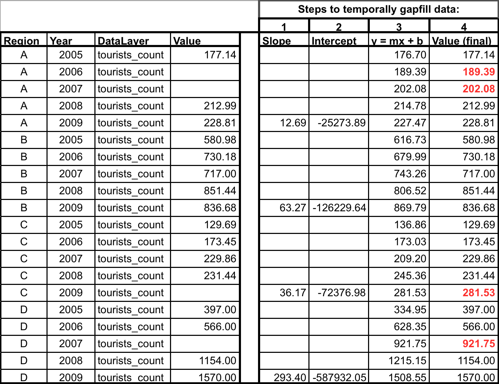
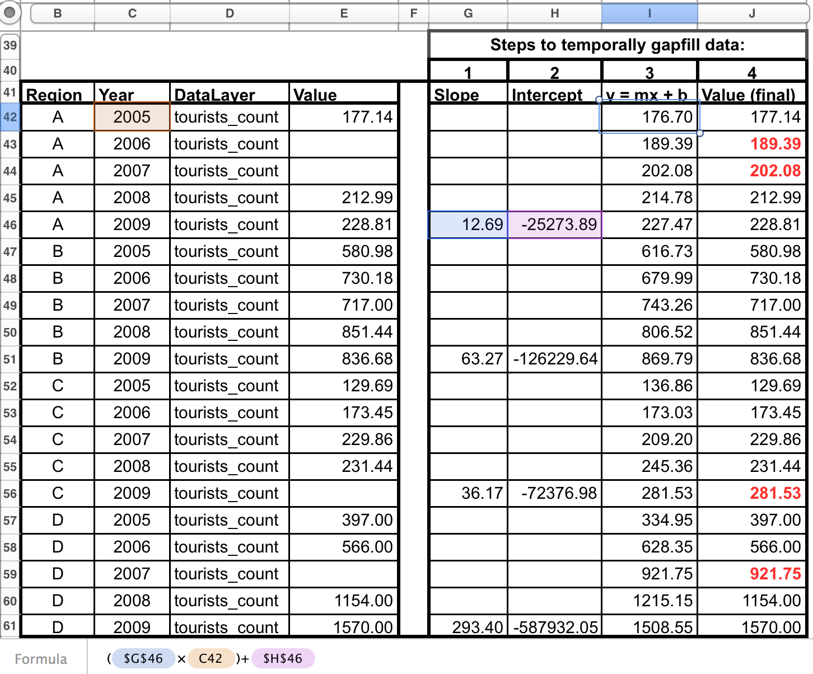

## Formatting Data for the Toolbox

### Introduction

The Ocean Health Index Toolbox App is designed to work in the programming language **R** using input data stored in text-based .csv files (.csv stands for 'comma-separated value'; these files can be opened as a spreadsheet using Microsoft Excel or similar programs). Data layers (data input) each have their own .csv file that are combined within the Toolbox in model calculations. These data layers are used for calculating goal scores, meaning that they are inputs for status, trend, pressures, and resilience. In the global analysis, there were over 100 data layer files included, and there will be as many in regional applications, no matter what the spatial scale. This document describes and provides examples of how to format data for the Toolbox App.

Ocean Health Index goal scores are calculated at the scale of the reporting unit, which is called a ‘**region**’ and then combined using a weighted average to produce the score for the overall area assessed, called a ‘**study area**’. The OHI Toolbox App expects each data file to be in a specific format, with data available for every region within the study area, with data organized in 'long' format (as few columns as possible). In order to calculate trend, input data must be available as a time series for at least 5 recent years (and the longer the time series the better, as this can be used in setting temporal reference points). 

It is important that data prepared for the Toolbox App have no missing values or 'gaps'. Data gaps can occur in two main ways: 1) **temporal gaps**: when several years in a time series in a single region have missing data and 2) **spatial gaps**: when all years for a region have missing data (and therefore the whole region is 'missing' for that data layer). How these gaps are filled will depend on the data and regions themselves, and requires a thoughtful decision to most reasonably fill the gap. Each data layer can be gapfilled using different approaches. Some data layers will require both temporal and spatial gapfilling.

In the example below, there are two data layers (tourists_count and jobs_tourism_count) that have data for four regions, A - D. In this example, the two data layers are appropriate for status calculations with the Toolbox because:

1. At least five years of data are available, 
2. There are no data gaps
3. Data are presented in 'long' or 'narrow' format (not 'wide' format).

**Example of data in the appropriate format:**

If there is insufficient data, see the sections below to see examples of gapfilling.

For more information about types of gapfilling used in the 2013 global assessment, please see the [supplementary methods](www.oceanhealthindex.org/About/Methods/). 

### Temporal gapfilling

Temporal gaps are when some data are available for a region, but there are missing years. The Toolbox requires data for each year for every region.

Many times, creating a linear model is the best way to estimate data and fill temporal gaps. If data do not fit a linear framework, other models may be fit to help with gapfilling. Here we give an example assuming linearity.

Using a linear model can be done in most programming languages using specific functions, but here we show this step-by-step using functions in Excel.

> **Steps to temporally gapfill data (assumes linearity):**

> **1.** calculate the slope for each region using the SLOPE(known_y's,known_x's) function. 
[click on the cells to see the formula used]

> **2.** calculate the intercept for each region using the INTERCEPT(known_y's,known_x's) function
[click on the cells to see the formula used]

> **3.** calculate y for all years
[click on the cells to see the formula used]

> **4.** replace modeled values into original data where gaps had occurred.

Data layer is now ready for the Toolbox, gapfilled and in the appropriate format.

### Spatial gapfilling

Spatial gaps are when no data are available for a particular region.
