# Introduction
  
## The Ocean Health Index

**The Ocean Health Index (OHI)** project was created with a strong foundation in communication and collaboration. Following the initial publication by Halpern et al. 2012 in *Nature* (available at ohi-science.org/), we have conducted annual global assessments to track changes in global ocean health. At the same time, we have been developing the **Ocean Health Index Toolbox** software that will enable others to conduct assessments on their own using the OHI framework. Here, the **Ocean Health Index Manual** describes how to use the Toolbox software.

OHI scores by goal are calculated at the scale of the reporting unit, which is called a **region** and then combined using a weighted average to produce the score for the overall area assessed, called a **study area**. 


## The Ocean Health Index Toolbox

**The Ocean Helath Index Toolbox Application (App)** is open-source software developed to facilitate Index calculations at any scale. The Toolbox App runs using the statistical programming language R and displays input data and calculated scores graphically with maps, histograms, and tables. Goal scores are calculated for each region separately and then combined using a weighted average to produce the score for the overall study area assessed. Modifications can be made to the global studies, allowing calculation of scores with updated data that can then be visualized with the Toolbox App. 

The Toolbox can also be used to calculate scores in smaller-scale **regional assessments** after finer-scale data has been gathered and decisions have been made regarding goal models, pressures and resilience, and reference points. The Toolbox App therefore enables the Ocean Health Index framework to be customized to an area of interest, incorporating the data, indicators, and priorities regarding ocean-derived benefits that are relevant to the chosen area. The App can additionally be used to compare how different management scenarios could affect overall ocean health, which can inform effective strategies for ocean resource management at a local scale.

We recommend first becoming familiar with the Toolbox App and exploring the results from the global assessment before beginning a regional assessment.

**Requirements**: an Internet connection for the initial Toolbox App installation. The Toolbox runs on both a Mac and PC.

1. Install the latest version of R (http://cran.r-project.org/).
2. Install and launch the Toolbox Application (http://ohi-science.org/pages/install.html).

# Overview of the OHI Toolbox App

The Toolbox Application (App) runs through a web browser and has three **Page options**: *Data*, *Calculate*, and *Report*. The *Data* page provides several ways of viewing the data (*Map*, *Histogram*, *Table*), and is the default home-screen when the Toolbox is opened. The *Calculate* page is used to calculate goal scores based on the information in the file system (data can be changed and tested). The *Report* page provides different methods of reporting the data.  
  
The **Current scenario** is displayed in the upper-right corner of the Data page. This identifies the scale (example: global) and year (example: 2013) of the information displayed.  
  


## Data page

### Overview of display options
The Data page displays input data or calculated scores for each goal parameter, and presents the information as a Map, Histogram, or Table. These options are presented as tabs located above the map (Map view is the default display option for the Data page).


**Data displayed in Map form:**
  


The map displays data for every region as reported in the scenario. A color legend is displayed in the lower right corner of the map that provides a linear colormap of the data. The range of values will change as different variables are selected.


**Data displayed in Histogram form:**


The histogram shows the distribution of the selected variable as the number of observations per value bin (white bars) and a smoothed density function (pink shading).


**Data displayed in Table form:**
  


The table displays the target value for each region and the overall study area. It provides an identifying code (rgn_id), name (rgn_name), and value (value) for each.


### Overview of variable options

The Data page has drop-down menus from which the user chooses the data to be displayed by the Toolbox. The data selected from the pull-down menus can be viewed in Map, Histogram, or Table form as described in the 'Overview of display options' section above. Descriptions, statistics and metadata for the chosen fields are also displayed below the drop-down menus on the left side of the page.


The first selection to be made from the drop-down menus is variable type, in which the user can choose the **Output Score** that will show a calculated score (for a particular target chosen subsequently), or **Input Layer** that will show the data layer used to calculate the score of a particular target. 

> In short: **Output Score = Calculated Score** and **Input Layer = Data**

For example, if the user selects ‘Output Score’ as the variable type (which is the default), they will then be able to choose a goal/sub-goal (target), and the goal/sub-goal score calculation (dimension) to be reported.

On the other hand, if the user selects “Input Layer” as the variable type, they will be able to choose a target and a specific data layer that is associated with that target. If that layer has multiple categories or years available, the user will be able to select a preference, with a default being the first category alphabetically and the most recent year.


To further familiarize yourself with the display and variable options of the Toolbox App, please see the 'Explore Global Results with the Toolbox App' section below.

## Calculate page
The Calculate page is used to calculate the Index. The Calculate page displays the “Scenario path” in the user’s home directory where the folders are located.

  
  

## Report page
The Report page allows the user to create a report of results as .html and .pdfs files.


It is currently possible to create flower plots and tables with several options, including saving global figures or figures per country. In future versions of the Toolbox App, more options for visualizations, including maps, histograms, and equations, will be possible. It will also be possible to compare different scenarios.

# Explore Global Results with the Toolbox App

The following section will be devoted to exploring the Ocean Health Index Global Results using the Toolbox App. The section will further familiarize the user with the organizational structure and functionality of the Toolbox, and will also help the user understand the results that were obtained in the global assessment,  including the types of data that were used to calculate the Ocean Health Index.

To begin exploring results, the user must first select (from the drop-down menus) the data that they wish to display with the Toolbox (i.e. variable type > target > dimension/layer > category > year).

**For example:**

> **Output Score > Fisheries (FIS) > score**
shows the final calculated score for the fisheries sub-goal in the current scenario (2013).


> **Input Layer > Mariculture > Mariculture species harvested**
shows the different harvested species that were used to calculate the mariculture sub-goal in the current scenario (2013).

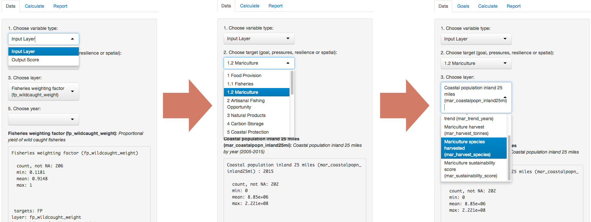

As mentioned previously, the selected data can then be viewed as a Map, as a distribution on the Histogram tab or numerically in Table form.

## Map 

Suppose for instance that **Output Score > Index > score** is selected and viewed as a map (default selection).


The target (Index) and dimension (Score) chosen from the drop-down menu is displayed as text on the top right corner of the map. Below this information, the region name, (region number), and value appear if the user’s mouse hovers over a specific region. When the value of that region is displayed, the region will darken on the map. If the mouse is not indicating a specific region, this area will instruct to ‘hover over a region’. Zooming in and out of the map is possible with the plus/minus in the upper left of the map. A color legend is also displayed in the lower right corner of the map that provides a linear colormap of the data. The range of values will change as different variables are selected.

## Histogram

For example, if the **Output Score > Fisheries > score** sub-goal is selected, the histogram shows the frequency of each fisheries score:


As noted in the figure above, the Histogram view allows the user to see the range of scores (lowest and highest) as well as the frequency of each (most vs. least common). The latter may be helpful for instance if the user wishes to compare to score of a particular country to all the other scores.

## Table

The table displays the target value for each region and the overall study area, with an identifying code (rgn_id), name (rgn_name), and value (value) for each. The Table view can be especially useful in quickly finding values for a particular country, given that the user can easily navigate the OHI data using the search bar located on the upper right of the table (caps-sensitive).


<<<<<<< HEAD
=======
It is also possible to search within individual columns by entering the search term at the bottom of each column; this option is more easily displayed by changing the number of records per page to 10 using the drop-down menu. Data may also be sorted the arrows at the left of each column name. Sorting by rgn_id is the default.

>>>>>>> FETCH_HEAD
---
output: html_document
---
# Introduction to OHI Regional Assessments

Regional assessments use the Ocean Health Index framework to study smaller spatial scales, often where policy and management decisions are made. Using ten criteria (goals), the Index scores how well coastal regions optimize their potential ocean benefits and services in a sustainable way relative to self-established reference points (targets), on a scale of 0 to 100. Regional assessments incorporate local priorities, higher-resolution data and indicators, and use tailored goal models and reference points, which produce scores better reflecting local realities. The OHI is designed to combine existing work into a comprehensive assessment of ocean health. And because the assessments are developed at the scale of decision-making using local data and parameters, the findings can help inform decision-making and management actions aimed at maximizing sustainable productivity while preserving vital natural capital.  

Scores by goal are calculated weighted average to produce the score for the overall area assessed, called a **study area**. In regional assessments, coastal states or provinces are often the **regions** within a country, which is the **study area**. 

  


The Ocean Health Index framework is flexible to accommodate regional priorities: goal models should be modified to incorporate the best available local data and indicators, or excluded entirely to best represent regional attributes. Similarly, pressures and resilience measures can be refined using local data and indicators. Calculated Index scores are only as 'good' as the data on which they are based, so finding the best data or indicators available is fundamental. 


**The process for developing a regional assessment can be as valuable as the final calculated scores, since it creates an ocean alliance that combines knowledge and cultural values from many different perspectives and disciplines**. Calculating Ocean Health Index scores at regional scales requires engagement from as many different groups as possible, including research institutions, government agencies, policy groups, non-governmental organizations, and the civil and private sectors.
  
Regional assessments have been published in peer-review journals for the U.S. West Coast (Halpern et al. 2014) and for Brazil (Elfes et al. 2014), and more are underway (available at ohi-science.org/).   

## Before getting started

Before beginning a regional assessment, it is important to have planned several things:

* Develop strategic plan and timeline
    + determine resources available
    + outline timeline with any meetings and workshops necessary
    + engage management early for results to be most useful (optional)
* Assemble a qualified team with diverse skills
    + have a broad scientific understanding and experience with environmental policy
    + are comfortable with handling large data sets, making decisions, and thinking creatively
    + collaborate well in a multidisciplinary team, remotely and in person
    + can work with the software program R and user-created packages (at least one person)
    + can work with ArcGIS or other spatial analysis software (at least one person)
    + are fluent in English (at least one person)
* Funding 
    + greatly depends on the local context
    + potentially needed for a management and scientific team, workshops and meetings (including travel), communications, policy engagement, and operating costs
* Policy and management interest (optional)
    + engage policy makers early: informing government policies to improve ocean health is most effective if there is early interest and engagement from government agencies
    + requires ongoing communication during Index development to best inform management actions that could have measurable impacts. 
    + repeated assessments as new data become available enable tracking ocean health through time and evaluating management priorities
    
    
    

# Conducting a Regional Assessment

## What to expect when conducting a regional assessment

There are key considerations and processes that will be a part of every regional assessment, however, how each regional assessment is conducted will be unique depending on the local context. For example: what data and indicators are available will determine how goal models are able to be tailored to the region, and what skillsets and resources are involved will affect the time it takes to complete the assessment. 

### Timeline 

The time required to complete a regional assessment depends on the local context and available resources, but the proportion of time required for different phases of the assessment is more predictable.  

**Expect for strategic planning, discovering and gathering data, and developing reference points and models, to comprise > 80% of the time allotted for the regional assessment**. 

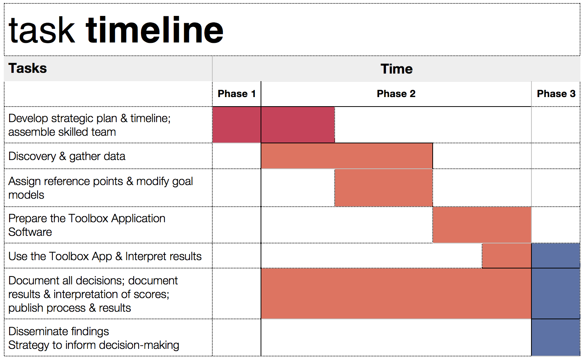  
    
## What is provided  

The Ocean Health Index Toolbox can be used to calculate scores for regional assessments. When you begin a regional assessment, you will be provided with a **repository**: a set of Toolbox files and software scripts specific to your study area. The data in the files provided serve as a template: they are the data used in the global assessments, extracted for your study area. These data files will need to be updated with locally available data and indicators so as to give a more fine-scale assessment of ocean health in your study area. However, if better data are not available, it is possible to use the files provided.  

Our team of scientists and managers is prepared to provide guidance for regional assessments, from initial meetings to discussions about model development to disseminating results.

## Points to remember

We recommend to remember the following as you develop your approach:

* People are part of ocean health
    + economic and social data are included, and certain terrestrial data near the coast
* Document all decisions made
    + document data sources, urls, date of access, reference points set, why models were modified the way they were (and not other potential ways)...
    + important for transparency, describing methods and explaining results in reports and publications, and for reproducibility (for any future comparable assessments in your study area)
* Goal models should be modified to capture local characteristics and priorities of the region
    + how goal models are developed depends on what is important locally and what data/indicators are available.
* Assessments can use a mixture of regional-, country- and global-scale data   
* Scores are calculated by region
    + comparing scores between subcountry regions is a main reason of conducting a regional assessment
    + regional scores are combined by weighted average to calculate scores for the study area
    + goal models are the same across all regions; data are specific to the region. For example, the carbon storage goal model is calculated in the same way for each region, but which habitats are present in each region, and the area and condition of those habitats are specific to each region
* All data do not need to be at the same spatial or temporal scale
    + each assessment should represent the best understanding of ocean health at the point in time. For example if fisheries data are available from 1980-2011 and tourism from 2008-2012; these can be used together to calculate Index scores, which will be the representation of current ocean health


## Checklist: To Do Before Using the Toolbox

Most of the time spent while conducting a regional assessment occurs before using the Toolbox, although being familiar with the Toolbox's composition and structure can help guide you. The following will not be checked-off in sequence: there is a lot of back and forth as you discover data, develop reference points and models, revisit other data possibilities.  

Here is a checklist of decisions and steps that must be done before the Toolbox can calculate regional goal scores:

* Understand the philosophy of the Ocean Health Index
    + understand what goals represent and how they are modeled 
    + understand what pressures and resilience are included 
    + understand how reference points are set
* Identify local characteristics and priorities
    + should any goals be removed?
    + should any goals be redefined?
    + should other goals be added?
    + should goals be weighted unequally? 
    + what are pressures to the local system?
    + what resilience measures (laws, regulations) are in place locally?
    + what local cultural preferences or priorities should be captured in the assessment? 
* Decide the spatial scale for regions within the study area 
    + we recommend multiple regions
    + regions within the study area should be at the smallest scale the data allow
    + in what spatial scale are data most frequently reported?
    + in what spatial scale are policy decisions made (optional)?
* Be familiar with the global inputs to your Toolbox repository
    + understand the data and models used in global assessments
    + prioritize which data and models should be updated 
    + become familiar with the Toolbox framework for your study region
      - example: ohi-science.org/ecu
* Discover and gather appropriate data and indicators
    + what local data and indicators are available for goal models?
    + what local data and indicators are available pressures and resilience?
    + how would reference points be set for local data?
    + do local data and indicators capture the philosophy of the Ocean Health Index?
    + are local data and indicators at the appropriate spatial and temporal scales?
    + process and format data and indicators to create data layers* for the Toolbox
    + use the Toolbox repository as a registry to organize data layers
* Update pressures and resilience
    + determine whether all global pressures are relevant locally
    + identify local pressures not captured in the pressures matrix
    + categorize any new pressures layers
    + set pressure weighting/ranking based on literature, expert opinion
    + identify responsive resilience measures
    + categorize any new resilience layers
* Modify goal models and set reference points:
    + can goal models be refined using locally available data and indicators?
    + can reference points be refined using locally available data and indicators?
    
    
\* Each data component that is included in the OHI is called a **data layer** because it will be combined with others to create the most complete picture of ocean health. Many data layers are rescaled from 0-1 to be combined with others on the same unitless scale.
    


## Discovering and Gathering Appropriate Data and Indicators

The OHI spans disciplines and integrates diverse data and sources to give a comprehensive assessment of ocean health. A hallmark of the OHI is that it uses freely-available data to create models that capture the philosophy of individual goals, and finding appropriate data requires research and creativity. There are many decisions to make when gathering from disparate sources, deciding reference points, and developing goal models.

**Index scores are a reflection of data quality, and thus accessing the best data and indicators available is of highest importance**. 

### Data sources 

Existing data and indicators can be gathered from many sources across environmental, social, and economic disciplines, including:

* government reports
* government websites
* academic literature
* masters and PhD theses
* university websites
* non-profit organizations

All data will be rescaled to specific reference points (targets) before being combined; therefore setting these reference points at the appropriate scale is a fundamental component of any OHI assessment. This requires the regional assessment team to interpret the philosophy of each Index goal and sub-goal using the best available data and indicators.  


### Data gathering responsibilities

Gathering appropriate data requires searching for and accessing freely-available data. It is important that team members responsible for data discovery make thoughtful decisions about whether data are appropriate for the regional assessment, and that they also get feedback from the full team to discuss the merits of different data sources. Data discovery and acquisition can be quite an iterative process, as there are both practical and philosophical reasons for including or excluding data, in addition to requiring access to the data.

Index scores can be recalculated annually as new data become available. This can establish a baseline of ocean health and serve as a monitoring mechanism to evaluate the effectiveness of actions and policies in improving the status of overall ocean health. This is good to keep in mind while looking for data: will it be available again in the future? It is also important to document the sources of all data so that it is both transparent where it came from and so that you will be able to find it again in the future. 


### The process of data discovery

In terms of philosophical considerations, the most important thing to remember when gathering data is that the data must contribute to measuring ocean health. Many data sources that enhance our knowledge of marine processes may not directly convey information about ocean health and may not be appropriate within the OHI framework. Because of this, compiled indicators can sometimes be more suitable than would raw data measuring single marine attributes.

Begin by understanding and comparing the best approaches used in assessments that have been completed, including global assessments, Brazil, and the US West Coast. If finer-resolution local data were available in the study area, they could be used either in a newly developed regional goal model using locally appropriate and informed approaches, or in the existing global goal model. When local data were not available, the same global-scale data were used with the original global goal model, which is least desirable because it does not provide more information than the global study. When looking for data, the following decision tree may be useful. This should be a goal-by-goal process:


Searching for data requires exploring data sources beyond any single discipline, and a good place to start is with an internet search. Internet searches can lead to published data in government and non-governmental organization reports, peer-reviewed articles, and masters and doctoral dissertations. Not everything will be freely available online but it is sometimes possible to request access.

It is good practice to keep detailed notes of attributes of each potential data layer, since there may be different options to work with. Searching for data by goal is a good approach, although some data layers will be used for multiple goals.

### Requirements for data layers

Four requirements to remember when investigating (or ‘scoping’) potential data layers are: 

1. relevance to ocean health 
2. how to set the reference point
3. spatial scale
4. temporal scale.

*Note: Once the appropriate data layers are chosen, they may need to be re-formatted in order to be readable by the toolbox (See: 'Formatting Data for Toolbox' section below).* 

#### Relevance to ocean health  

There must be a clear connection between the data and ocean health, and determining this will be closely linked to each goal model.

#### Reference point  

As each data layer must be scaled to a reference point, as you consider different data sources it is important to think about or identify what a reasonable reference point may be. Ask the following types of questions as you explore data possibilities:

  * Is there a known relationship associated with these data?
  * Have policy targets been set regarding these data?
  * Would a historic target be appropriate?
  * Could a region within the study area be set as a spatial target?
  
#### Appropriate spatial scale  

Data must be available for every region within the study area.*

#### Appropriate temporal scale  

Data must be available for at least five years to calculate the trend. Longer time series are preferable because this can be used to set temporal reference points.*

\* It is not always possible to meet the spatial and temporal requirements with each data layer. In these cases it can still be possible to use these data if appropriate gap-filling techniques are used (See: 'Formatting Data for Toolbox' section below). It is important that data satisfy as many of these requirements as possible, and in cases where creative ways of working with such data are not possible, it might be better to exclude these data from the analyses and try a different approach.

### Notes about data and regions

Final calculated scores by region will be represented on a map in addition to the flower plot. The map displays scores in the exclusive economic zone (EEZ) of the region. This is a visualization that exactly maps the availble information of some data layers, but not all. Therefore, available data do not need to have been collected for all of the region's EEZ, but they need to be available for the region itself.


### Example: US West Coast data discovery

Below are examples of some decisions made when exploring available data for the US West Coast regional assessment. Determining whether certain data could be included started with a good understanding of the data layers and models included in the global assessment, and because the US West Coast is a data-rich region, finer-resolution local data could be used in place of many of the global data layers.

#### Reasons data were excluded  

There are a lot of existing data that contribute to our scientific understanding of ocean processes and interactions but that are not ideal for the OHI. Reasons to exclude data occur both on a practical level (do data adhere to the requirements above?) and on a philosophical level, which requires reflecting on the relationship with ocean health. Some common reasons for excluding data are listed below:

  * 
  **The data do not cover the entire area of the reporting region**. The state of California had excellent, long-term data on public attendance at state parks that would have been quite useful in the calculation of the tourism and recreation goal. However, Oregon and Washington did not have these same data so they were not used.

  * 
  **There is not a clear and scientifically proven connection between the metric described by the data and ocean health**. 
Along the US West Coast, kelp beds are a very important habitat because of their contribution to biodiversity and coastal protection. However, kelp coverage is quite variable and is driven primarily by abiotic natural forcing (wave/storm disturbance and temperature) and thus kelp coverage is not a good metric of ecosystem health. For these reasons kelp coverage was not included in the assessment.

  * 
  **The feature being measured may provide benefits to people, but this feature is not derived from the ocean**.
Sea walls and riprap provide coastal protection to many people along the US West Coast. However, these structures are not a benefit that is derived from the ocean itself, so only biogenic habitats were included in the calculation of this goal. These data can be included as a pressure due to habitat loss.

  * 
  **Data collection is biased and might misrepresent ocean health**.
The US Endangered Species Act identifies a species list focused on species of concern within the US. As such, these data are biased in the context of ocaean health since they assess only species whose populations may be in danger. For the calculation of the biodiversity goal, using these data would be inappropriate because this goal represents the status of all species in the region, not just those that are currently of conservation concern. Using these data may have shown the status of biodiversity to be lower than it really is because the selection of species to assess was already biased towards species of concern.

#### Creative approaches to using data

  * 
  **Time series data are not long enough to calculate a trend or a reference point (when a historical reference point is most appropriate)**.
For the US West Coast, available data measure the current extent of seagrass habitats, however, these only exist for one time point in most areas so could not be used to calculate the trend or set a historical reference point. As these were the best data available for habitat coverage, we built a model to calculate the status and trend of seagrass habitats using other data that were available over time. A reasonable approach was to model the pressures exerted on seagrasses over time as a proxy for seagrass health.

## Formatting Data for the Toolbox

### Introduction

The Ocean Health Index Toolbox App is designed to work in the programming language **R** using input data stored in text-based *.csv* files (*csv* stands for 'comma-separated value'; these files can be opened as a spreadsheet using Microsoft Excel or similar programs). Data layers (data input) each have their own .csv file that are combined within the Toolbox in model calculations. These data layers are used for calculating goal scores, meaning that they are inputs for status, trend, pressures, and resilience. In the global analysis, there were over 100 data layer files included, and there will be nearly as many in regional applications, no matter what the spatial scale. This document describes and provides examples of how to format data for the Toolbox App.

Ocean Health Index goal scores are calculated at the scale of the reporting unit, which is called a ‘**region**’ and then combined using a weighted average to produce the score for the overall area assessed, called a ‘**study area**’. The OHI Toolbox App expects each data file to be in a specific format, with data available for every region within the study area, with data organized in 'long' format (as few columns as possible), and with a unique region identifier (*rgn_id*) associated with a single *score* or *value*. In order to calculate trend, input data must be available as a time series for at least 5 recent years (and the longer the time series the better, as this can be used in setting temporal reference points).

The example below shows information for a study area with 4 regions. There are two different (and separate) data layer files: tourism count (tr_total.csv) and natural products harvested, in metric tonnes (np_harvest_tonnes.csv). Each file has data for four regions (1-4) in different years, and the second has an additional 'categories' column for the different types of natural products that were harvested. In this example, the two data layers are appropriate for status calculations with the Toolbox because:

1. At least five years of data are available, 
2. There are no data gaps
3. Data are presented in 'long' or 'narrow' format (not 'wide' format).

**Example of data in the appropriate format:**

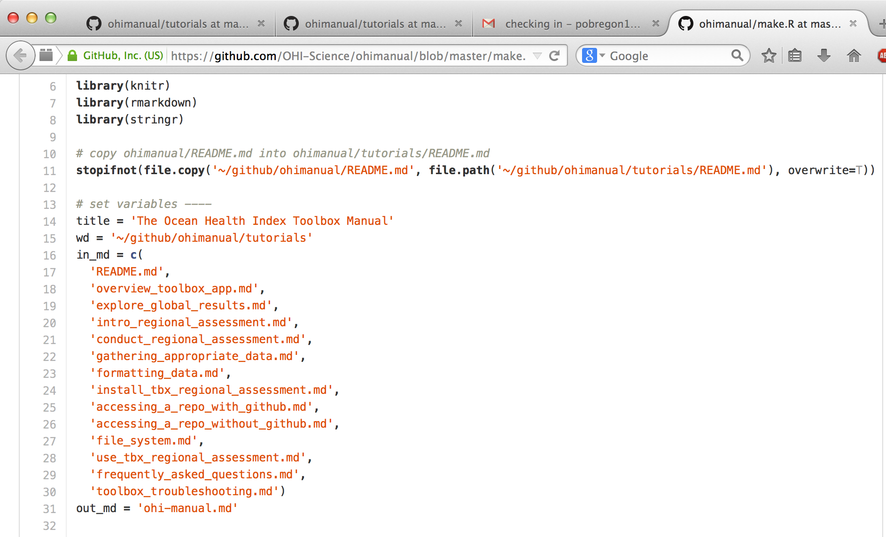

### Gapfilling

It is important that data prepared for the Toolbox App have no missing values or 'gaps'. Data gaps can occur in two main ways: 1) **temporal gaps**: when several years in a time series in a single region have missing data, and 2) **spatial gaps**: when all years for a region have missing data (and therefore the whole region is 'missing' for that data layer). 

How these gaps are filled will depend on the data and regions themselves, and requires thoughtful, logical  decisions to most reasonably fill gaps. Each data layer can be gapfilled using different approaches. Some data layers will require both temporal and spatial gapfilling. The examples below highlight some example of temporal and spatial gapfilling.  

All decisions of gapfilling should be documented to ensure transparency and reproducibility. The examples below are in Excel, but programming these changes in software like R easily enables transparency and reproducibility. 

#### Temporal gapfilling

Temporal gaps are when some data are available for a region, but there are missing years. The Toolbox requires data for each year for every region. It is important to make an informed decision about how to temporally gapfilling data.

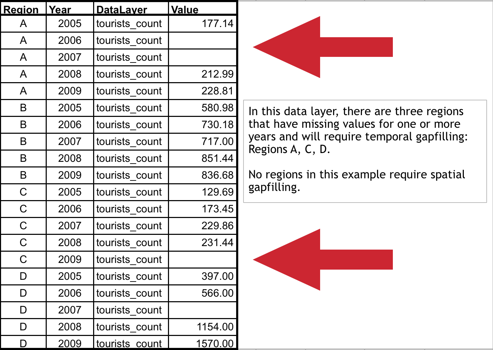

Many times, creating a linear model is the best way to estimate data and fill temporal gaps. If data do not fit a linear framework, other models may be fit to help with gapfilling. Here we give an example assuming linearity.

Using a linear model can be done in most programming languages using specific functions, but here we show this step-by-step using functions in Excel for Region 1.

** Temporal gapfilling example (assumes linearity):**

There are four steps to temporally gapfill with a linear model, illustrated in the figures with four columns.

**1. Calculate the slope for each region**

The first step is to calculate the slope of the line that is fitted through the available data points. This can be done in excel using the **SLOPE(known_y's,known_x's)** function as highlighted in the figure below. In this case, the x-axis is *years* (2005, 2006, etc...), the y-axis is *count*, and the Excel function automatically plots and fits a line through the known values (177.14 in 2005, 212.99 in 2008, and 228.81 in 2009), and subsequently calculates the slope (12.69).

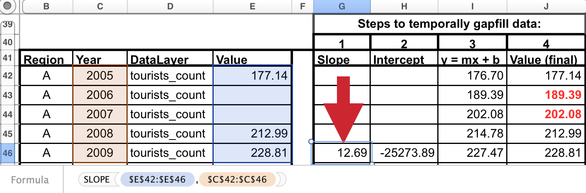 

**2. Calculate the y-intercept for each region**

The next step is to calculate the intercept of the line that is fitted through the available data points. This can be done in excel similarly as for the slope calculation, using the the **INTERCEPT(known_y's,known_x's)** function that calculates the y-intercept (-25273.89) of the fitted line.

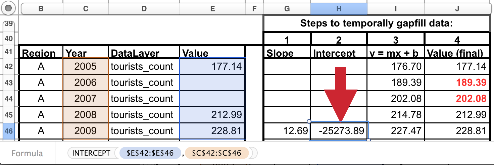

**3. Calculate y for all years**

The slope and y-intercept that were calculated in steps 1 and 2 can then be used along with the year (independent variable) to calculate the unknown 'y-values'. To do so, simply replace the known three values into the **y = mx + b** equation, to calculate the unknown 'count' for a given year (189.39 in 2006, and 202.08 in 2007).

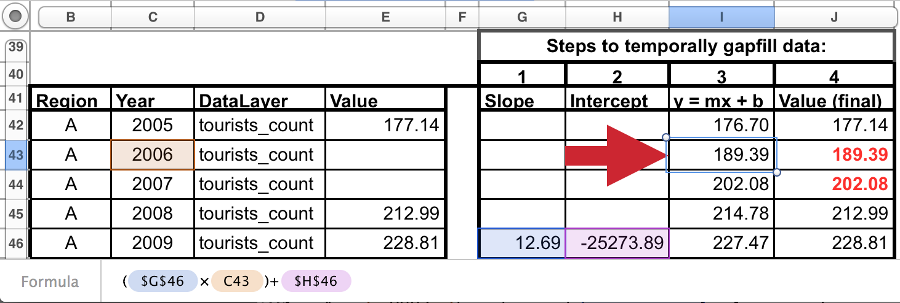

**4. Replace modeled values into original data where gaps had occurred**

Substitute these modeled values that were previously gaps in the timeseriew. The data layer is now ready for the Toolbox, gapfilled and in the appropriate format.


#### Spatial gapfilling

Spatial gaps are when no data are available for a particular region. The Toolbox requires data for each region. It is important to make an informed decision about how to spatially gapfilling data.

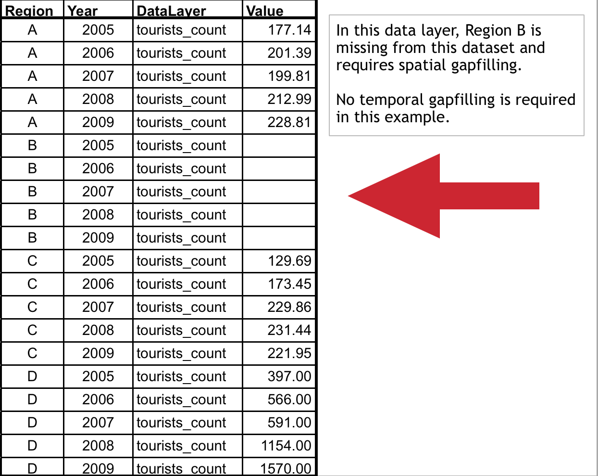

To fill gaps spatially, assumptions must be made that one region is like another, and data from another region will be substituted in place of the missing data. This will depend on the type of data and the properties of the regions requiring gapfilling. For example, if a region is missing data but has similar properties to a different region that does have data, the missing data could be 'borrowed' from the region with information. Each data layer can be gapfilled using a different approach when necessary.

**Characteristics of region regions requiring gapfilling that can help determine which type of spatial gapfilling to use:**

1. proximity: can it be assumed that nearby regions have similar properties? 

2. study area: are data reported for the study area, and can those data be used for subcountry regions?

3. demographic information: can it be assumed a region with a similar population size has similar data? 


**Spatial gapfilling example:**

For a certain data layer, suppose the second region (rgn_id 2) has no data reported, as illustrated in the figure above. How to spatially gapfill rgn_id 2 requires thinking about the properties and characteristics of the region and the data, tourist count. 

Here are properties that can be important for decision making:

rgn_id 2:

- is located between rgn_id 1 and 3
- is larger than rgn_id 1
- has similar population size/demographics to rgn_id 3
- has not been growing as quickly as rgn_id 4

There is no absolute answer of how to best gapfill rgn_id 2. Here are a few reasonable possibilities:

Assign rgn_id 2 values from:

- rgn_id 1 because it is in close proximity to rgn_id 2
- rgn_id 3 because it is in close proximity to rgn_id 2 and has similar population size/demographics
- rgn_id 1 and 3 averaged since they are in close proximity to rgn_id 2

Suppose the decision was made to gapfill rgn_id 2 using the mean of rgn_id 1 and 3 since this would use a combination of both of those regions. Again, other possibilities could be equally correct. But some form of spatial gapfilling is required so a decision must be made. The image below illustrates this in Excel.

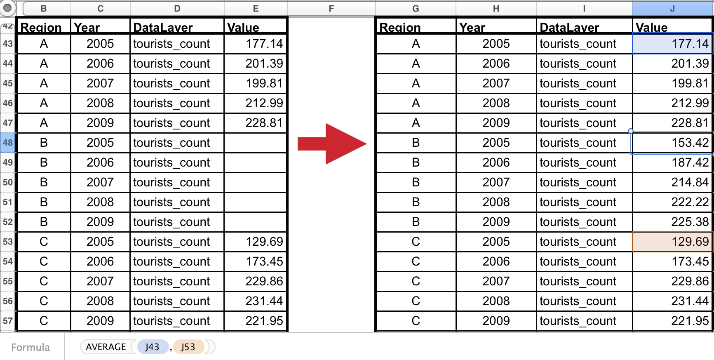

The data layer is now ready for the Toolbox, gapfilled and in the appropriate format.  

### Long formatting

The Toolbox expects data to be in 'long' or 'narrow' formatting. Below are examples of correct and incorrect formatting, and tips on how to transform data into the appropriate format.

**Example of data in an incorrect format:**


With 'wide' format, data layers are more difficult to combine with others and more difficult to read and to analyze.

**Transforming data into 'narrow' format:**

Data are easily transformed in a programming language such as R. 

In R, the `reshape` package has the `melt` command, which will melt the data from a wide format into a narrow format. It also can `cast` the data back into a wide format if desired. R documentation: 

- http://cran.r-project.org/web/packages/reshape2/reshape2.pdf
- http://www.slideshare.net/jeffreybreen/reshaping-data-in-r
- http://tgmstat.wordpress.com/2013/10/31/reshape-and-aggregate-data-with-the-r-package-reshape2/

Example code using the *melt* command in the *reshape2* library. Assume the data above is in a variable called *data_wide*:

```
install.packages('reshape2')
library(reshape2)
data_melt = melt(data=data_wide, id.vars=c('Region', 'DataLayer'), variable.name='Year')
data_melt = data_melt[order(data_melt$DataLayer, data_melt$Region),]
```

This will melt everything except any identified columns ('Region' and 'DataLayer'), and put all other column headers into a new column named 'Year'. Data values will then be found in a new column called 'value'. 

The final step is optional: ordering the data will make it more easy to read for humans (R and the Toolbox can read these data without this final step):

**Example of data in the appropriate format:**

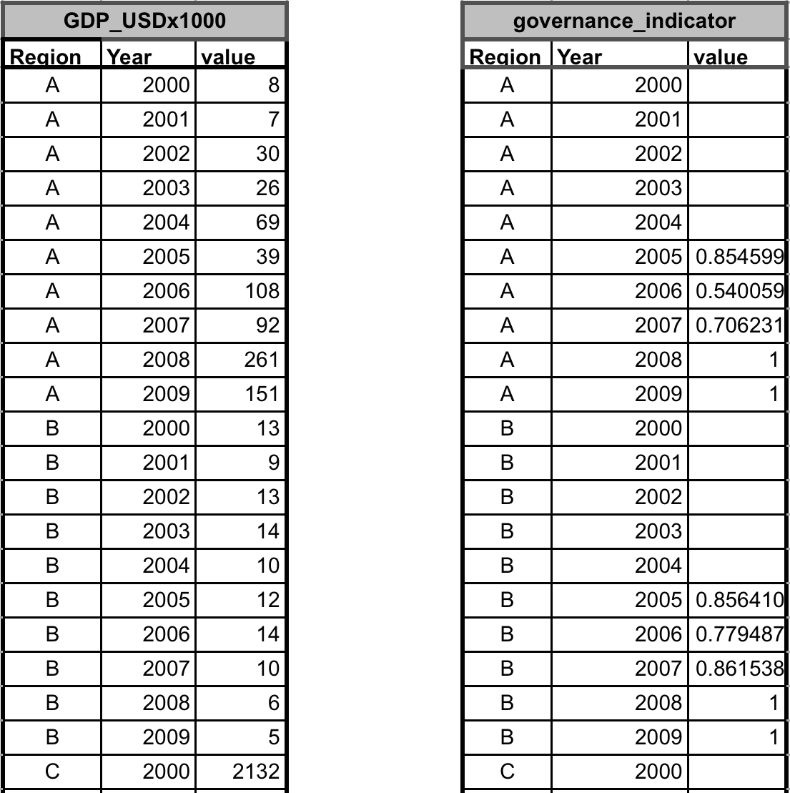

With 'narrow' format, each row of data provides complete and unique information, and does so with as few columns as possible. Data layers in this format can be easily combined with other data layers: the range of years available can be different for each data layer, and there are minimal column names.

## Updating pressures and resilience

### Introduction 

'Pressures' and 'Resilience' are two of the four dimensions with which each goal/sub-goal is evaluated (the other two are 'Present Status' and 'Future Trend'):

 + "**Pressures** are the sum of the ecological and social pressures that negatively affect scores for a goal".
 + "**Resilience** is the sum of the ecological factors and social initiatives (policies, laws, etc) that can positively affect scores for a goal by reducing or eliminating pressures".


For more general information on how OHI scores are calculated, see: http://www.oceanhealthindex.org/About/Methods/.

**Updating the pressure and resilience matrix for a new regional assessment will require the user to:**

 + Understand the pressures and resilience measures included in completed global assessment and determine whether they are relevant locally.
 + Identify and categorize new local pressures not captured in the pressures matrix.
 + Identify and categorize new local resilience measures (laws, regulations) not captured in the resilience matrix.
 + Set pressure and resilience weighting/ranking based on scientific literature and expert opinions.

**Before updating the pressure and resilience matrices however, please also consider the following:**

The Ocean Health Index framework calculates pressures by first grouping them into five ecological categories (pollution, habitat destruction, fishing pressure, species pollution, and climate change) and one social category. The reason behind the ecological categories was largely due to data availability at the global level and was designed to minimize sampling bias. For example, we found that there was more pollution data available than habitat destruction data, but just because people have monitored pollution more does not mean it is a larger pressure than habitat destruction. Ecologial and social pressures are assessed separately and then combined with equal weighting, which could be changed if there is local information on how to do so.

Ecological and social resilience are similarly assessed separately and then combined with equal weighting, which could also be changed based on expert opinions. Any new resilience measure must be associated with a pressure layer. This is because resilience in the Ocean Health Index framework acts to reduce pressures in each region. Therefore, resilience measures must not only be directly or indirectly relevant to ocean health, but must be in response to a pressure layer affecting a goal.

Note that goals often interact with each other through pressures. The pressure created by one goal may affect a second goal without being affected itself. For example, raising fish in the mariculture goal can cause genetic escapes, which is a pressure (the *sp_genetic* layer). This pressure affects only the wild-caught fisheries and species sub-goals, but does not affect mariculture itself. 


### Explore local pressures

Begin by exploring the pressures included in the global pressures matrix (`pressures_matrix.csv`). As illustrated below, pressures are either ecological or social, and are grouped into 6 categories: pollution, habitat destruction, fishing pressure, species pollution, climate change, and social pressures.


Pressures (columns in `pressures_matrix.csv`), are matched with different goals and subgoals (rows) to indicate which pressures will be included when goal scores are calculated. In some cases the goals are further divided into components (e.g. habitats are divided by habitat type, natural products by product type).

The first step in updating the pressures matrix for your regional assessment is to determine if there any pressures that should be excluded from your study? For example, if there is no mariculture in your study area, perhaps there are also no genetic escapes (*sp_genetic* layer).

Next, brainstorm local pressures that are not captured in `pressures_matrix.csv`. Which pressures stand out in your study area? Pressures included in the `pressures_matrix.csv` are ultimately determined by available data, and thus there were pressures that were important but could not be included in the global assessment because of data availability (including altered sediment regimes, noise and light pollution, toxic chemicals from point sources, and nutrient pollution from atmospheric deposition and land-based sources other than fertilizer application to agricultural land). There are likely pressures important to your study area that were not captured in the global pressures matrix.  

**Table of pressures layers and descriptions**

|layer            |name                                                                                              |
|:----------------|:-------------------------------------------------------------------------------------------------|
|cc_acid          |Ocean acidification                                                                               |
|cc_slr           |Sea level rise                                                                                    |
|cc_sst           |Sea surface temperature (SST) anomalies                                                           |
|cc_uv            |UV radiation                                                                                      |
|fp_art_hb        |High bycatch caused by artisanal fishing                                                          |
|fp_art_lb        |Low bycatch caused by artisanal fishing                                                           |
|fp_com_hb        |High bycatch caused by commercial fishing                                                         |
|fp_com_lb        |Low bycatch caused by commercial fishing                                                          |
|fp_targetharvest |Targeted harvest of cetaceans and sea turtles                                                     |
|hd_intertidal    |Coastal population density as a proxy for intertidal habitat destruction                          |
|hd_subtidal_hb   |High bycatch artisanal fishing practices as a proxy for subtidal hard bottom habitat destruction  |
|hd_subtidal_sb   |High bycatch commercial fishing practices as a proxy for subtidal soft bottom habitat destruction |
|po_chemicals_3nm |Land-based chemical pollution                                                                     |
|po_nutrients_3nm |Coastal nutrient pollution                                                                        |
|sp_alien         |Alien species                                                                                     |
|sp_genetic       |Introduced species as a proxy for genetic escapes                                                 |
|ss_wgi           |Weakness of governance indicated with the WGI                                                     |
|po_chemicals     |Ocean-based chemical pollution                                                                    |
|po_nutrients     |Ocean nutrient pollution                                                                          |
|po_pathogens     |Access to improved sanitation as a proxy for pathogen pollution                                   |
|po_trash         |Trash pollution                                                                                   |


**Some background** on the reasoning behind nutrient and chemical pollution in the global `pressures_matrix.csv`: Nutrient and chemical pollution were calculated from the global cumulative impact maps (spatial data). These data were clipped to each global region's EEZ: 200 km from the coast.  

* For some goals, the data clipped to the EEZ affects goals that occur far from shore, so `po_chemicals` applies to goals relevant offshore: FIS, MAR, ECO, and SPP. 
* However, some goals are really only relevant nearshore, so we clipped the spatial data again, to 3nm from shore and used this as a separate input. So `po_chemicals_3nm` applies to goals nearshore: AO, CS, CP, TR, ICO, LSP, HAB. 

These distinctions don't always apply for smaller-scale assessments. For example, in the US West Coast study (Halpern et al. 2014), only a single `po_chemicals` layer was used: we did not distinguish between offshore and 3nm.


### Determine how the pressure affects goals

Next, you will need to:

 + Map which goals are affected by a given pressure layer.
 + Determine the appropriate rank weighting (how important the pressure is for the delivery of the goal/component).
 + Decide in which pressure category the new pressure belongs.

These decisions should depend on expert opinions and previous scientific studies, even if they do not occur in your study area.

The original pressure matrix weights for instance were determined by Halpern *et al*. 2012 (*Nature*) based on scientific literature and expert opinion (3=high, 2=medium, and 1=low pressure; stressors that have no impact drop out rather than being assigned a rank of zero, which would affect the average score). Pressures are ranked rather than being represented as a binary (yes/no) measure because the range of consequence of different pressures on each goal can be quite large, and to classify all those pressures as a simple 'yes' would unduly give too much influence to the weakest stressors. For example, food provision is most heavily impacted by unsustainable, high-bycatch fishing, but pollution does have  some impact on fish stocks. Without a weighting system, these stressors would be treated equally in their impact on the food provision goal. 

Most likely, the new pressure will fit into one of the existing categories. However, depending on the type of pressures in your study area, it is possible that a new pressure category could be created.  

      
### Identify available pressures data

Like the global study, what pressures you are able to include in your regional study will also depend on data availability. Remember that each column in `pressures_matrix.csv` is a data layer, which requires data for each region in your study area. Begin with a list of local pressures that are important, and then refine if data are not available. 
  
In addition to data for the local pressures you identify, it will likely be possible to find better, local data to replace the global template data layers from the pressures matrix. In this case, you will first find local data and then update the pressure data layer as you would with any other data layer. See the 'modifying and creating data layers' section below for how to do this. 
      
      
### Explore local resilience 

As with the pressures matrix, begin by exploring the resilience measures included in the global resilience matrix (`resilience_matrix.csv`). As illustrated below, resilience is also grouped into ecological and social categories, and includes ecological components, goal-specific regulations, and social  components.


Goal-specific regulations intend to address ecological pressures, and are measured as laws, regulations, and other institutional measures related to a specific goal. Governance is a function of institutional structures that address the intended objective, implementing such governance, and whether stated objectives have been effectively met. Social integrity is intended to describe those processes internal to a community that affect its resilience. It is a function of a wide range of aspects of social structure within a region, and may not be strictly marine related, but can judge how well-governed areas are and therefore how well a region may be able to respond to or prevent environmental challenges.  

The first step in updating the resilience matrix for your regional assessment is to determine if there any resilience measures that should be excluded from your study? 

Next, brainstorm local resilience measures that are not captured in `resilience_matrix.csv`. What are important regulatory, ecological and social resilience measures in your study area? Resilience measures included in `resilience_matrix.csv` are also determined by available data, and thus it is possible to improve upon the resilience measures when doing an assessment at a spatial scale smaller than the global analysis.

**Table of resilience layers and descriptions**

|layer                 |name                                                            |
|:---------------------|:---------------------------------------------------------------|
|alien_species         |Alien species                                                   |
|cites                 |Resilience from commitment to CITES                             |
|fishing_v1            |CBD survey: coastal fishing v1                                  |
|fishing_v1_eez        |CBD survey: ocean fishing v1                                    |
|fishing_v2_eez        |CBD survey: ocean fishing v2                                    |
|fishing_v3            |CBD survey: coastal fishing v3                                  |
|fishing_v3_eez        |CBD survey: ocean fishing v3                                    |
|habitat               |CBD survey: habitat                                             |
|habitat_combo         |CBD survey: coastal habitat                                     |
|habitat_combo_eez     |CBD survey: ocean habitat                                       |
|li_gci                |GCI: competitiveness in achieving sustained economic prosperity |
|li_sector_evenness    |Sector evenness as a measure of economic diversity              |
|mariculture           |CBD survey: mariculture                                         |
|msi_gov               |MSI sustainability and regulations                             |
|species_diversity     |Ocean ecological integrity                                      |
|species_diversity_3nm |Coastal ecological integrity                                    |
|tourism               |CBD survey: tourism                                             |
|water                 |CBD survey: water                                               |
|wgi_all               |Strength of governance indicated with the WGI                   |

\* *CBD = Centre for Biological Diversity; GCI = Global Competitiveness Index; MSI = Mariculture Sustainability Index; WGI = World Governance Indicators*. 

Ecological integrity in the global assessment was measured as the relative condition of assessed species in a given location, and therefore is only relevant to a subset of goals (wild-caught fisheries, artisanal opportunity, natural products, iconic species, and species). Local measures of this component would potentially allow for more goals to be affected. 

### Identify regulatory resilience measures for any new ecological pressures

As you explore any new local resilience measures to be included, remember that any new pressure in the ecological resilience category with a rank of 2 or 3 will need a corresponding resilience measure. 


### Determine how the resilience measure affects goals

Next, you will need:

 + Map which goals are affected by a given resilience layer. 
 + Determine the appropriate rank weighting, (how important the resilience is in counteracting a pressure). 
 + Decide in which resilience category the new pressure belongs.

These decisions should depend on local expert knowledge and previous scientific studies, even if they do not occur in your study area. 


### Identify available resilience data

Resilience layers are intended to describe the measures that set rules and regulations to address ecological pressures, and are measured as laws and other institutional measures related to a specific goal. Data to address these resilience  components should fall into one of three categories: 

1. Existence of rules and regulations: Are there institutional structures in place to appropriately address the ecological pressure? 
2. Implementation and Enforcement: Have these structures been appropriately implemented and are there enforcement mechanisms in place? 
3. Effectiveness and Compliance: How effective has the structure been at mitigating these pressures and is their effective compliance with these structures?      

Social measures may not be strictly marine related, but can judge how well-governed areas are and therefore how well a region may be able to respond to or prevent environmental challenges.  


# Installing the Toolbox for a Regional Assessment 

## Getting started
The Ocean Health Index (OHI) Toolbox is software written in R that can be used to conduct regional assessments using the OHI framework. Ocean Health Index assessments have a specific organization of data files, registry files, and R scripts that work together to do calculations and present the final scores graphically. The files and scripts for any given assessment are packaged together in a folder called a **repository** ('repos'), and stored online through GitHub, an open-source development platform that enables easy collaboration with  versioning capabilities (See: http://en.wikipedia.org/wiki/GitHub).

It is possible to conduct a regional assessment by downloading a template repository from GitHub. We recommend having a GitHub user account and syncing with the online repository: this faciliates collaboration within your team but also allows us to provide support when you need it. However, it is possible to work independently without GitHub (after the initial download), although we cannot offer much support in this case.

**Requirements**: an Internet connection for the initial Toolbox App installation and continued access if syncing with GitHub (highly recommended); proficiency with data management and the coding language **R**; proficiency in spatial software such as ArcGIS (potentially, depending on the regional assessment strategy).

**1. Set up:**

 * Install R and RStudio
 * Clone regional assessment repository on Desktop

Detailed instructions for step **1** are provided below for users who want to either:

 * work with GitHub (See: Accessing repository with GitHub section), or 
 * work without GitHub (See: Accessing repository without GitHub section). 

**2. Become familiar with the OHI Toolbox File System**


Once the user has completed steps 1 and 2, they will then be able to make changes to the Toolbox to calculate regional scores (See: 'Using the Toolbox for a Regional assessment' section below).

## Accessing repositories with GitHub

### Overview

We recommend that groups interested in conducting OHI assessments do so using GitHub, which is an online interface for version-control software called *git*. GitHub has powerful versioning capabilities, which allows changes to be archived and tracked by each user. This is incredibly useful to not only to document what work has been done, but how it differs from work done in the past, and who is responsible for the changes: it provides a record of all changes made. Conducting an OHI regional assessment using GitHub will therefore enable collaboration and transparency, and will provide access to the latest developments in the Toolbox software. 

It is also possible to conduct a regional assessment without GitHub. We do not recommend this because it is more difficult for you to track progress and decisions, and for us to help or advise you. However, if this is preferable, see the instructions in the 'Accessing repositories without GitHub' section below. We can always get your filesystem onto GitHub later. 

To get started on an OHI assessments using GitHub, follow the steps below:

Software required for regional assessments with version control:

> 

### Install R and RStudio

Make sure you have the most current version of R and RStudio. (Hint: type `sessionInfo()` into the R console to see which version of R you have installed, and update it if this is not the most recent version available on CRAN at http://cran.r-project.org/). 


### Create a GitHub account

GitHub is an online interface for *git*, and to use it you must create a GitHub account at http://github.com. You will use this username and password when you install *git* and access your GitHub repository (next two steps below).


### Install *git* software

*git* is version-control software that you will need to install on your computer. Note that there are specific settings to select for **Windows** and **Mac**. 


**For Mac:**

  > Download *git* at http://git-scm.com/downloads and follow the install instructions. 

  > Apple's [Xcode](https://developer.apple.com/xcode/) has a command line tools option during install which can override the preferred Git command line tools. To ensure you are using the latest preferred version, do the following things in *RStudio* and in *Terminal*:

  > - *RStudio*

  >   Within RStudio, update your preferences for 'Git executable':
  
  > RStudio > Preferences... > Git/SVN > Git executable: `/usr/local/git/bin/git`
  
  >  

  > - *Terminal*
  
  >   From Terminal, add a line to your 'bash profile' (launch Terminal from Applications > Utilities > Terminal).
  
  >   First type:  `pico ~/.bash_profile`
  
  >   Add this line: 

  >   ```
  >   export PATH=/usr/local/git/bin:$PATH
  >   ```
  
  >   Type `control-X`, then `y` and then `return` keys to exit pico; type `exit` before quitting Terminal.  
  
  >   
  

**For Windows:**

  > Download *git* at http://git-scm.com/downloads and follow the install instructions. 

  > When running the Windows installer, use all default options except "Adjusting your PATH environment": instea, select "_**Run Git from the Windows Command Prompt**_". This will allow compatibility with RStudio.  
  
  > 
  
### Set up your Git Identity

After downloading and installing, you will then need to set up your Git Identity, which identifies you with any changes made. You will use the command line: 

* **Mac**: launch the Terminal application (Applications > Utilities > Terminal)
* **Windows**: go to command line in Windows (Start > Run > cmd)  
  
  
Substitute your GitHub username instead of jdoe:
```
git config --global user.name jdoe
```
and then: substitute the email address you used to create your GitHub account: 
```
git config --global user.email johndoe@example.com
```

You can check settings with the following:

```
git config --list
```

Quit the Terminal after typing:
```
exit
```


### Clone your  repo to your computer

OHI-Science is the 'owner' of the OHI repositories stored on GitHub at https://github.com/OHI-Science, and individual users contribute to these repositories when they have permission. The OHI team will create a repository for your assessment once you provide your GitHub username: email your username to bbest@nceas.ucsb.edu or lowndes@nceas.ucsb.edu.

The repository will be backed up and stored on github.com and you will also have a local version on your computer.

\*\* **Important:** Please create a folder called `github` in your root directory and save the repository there. This will make collaborating possible, particularly between Macs and Windows machines. The directory for the assessment `~/github/[assessment]` will therefore be:

+ on a Mac: `/Users/[User]/github/[assessment]`
+ on Windows: `C:\Users\[User]\Documents\github\[assessment]` 

Downloading a repository from GitHub is called **cloning** and there are multiple ways to do it. Cloning allows you to make changes on your local computer and sync them to the online repository. 


**Cloning options:**

There are several options to clone the repository to your local machine:

> 1. **GitHub App**

> 2. **Command line** (Windows) or **Terminal** (Mac)

> 3. **RStudio**

**1. The GitHub App** 

**(a)** For Mac (freely available at https://mac.github.com/):

Once the the GitHub App is installed and opened, the following page will appear:

> 

Follow the instructions for cloning on a Mac (copied from: https://mac.github.com/help.html)

> 


**(b)** For Windows:

Follow the instructions for cloning on Windows (copied from: https://windows.github.com/help.html)

> 


**2. The Command line (Windows) or Terminal (Mac)**

Below is an example for a repository called 'Spoon-Knife':

> 

(Instructions copied from: https://help.github.com/articles/fork-a-repo#keep-your-fork-synced)


**3. RStudio**

This is best after the initial clone, since RStudio occassionally has trouble with setting the username / password. Open RStudio, and follow the instructions below copied from: https://github.com/OHI-Science/ohiprep/wiki/Setup#rstudio.

> 


### Working locally
All of the files available from the online server repository `https://github.com/OHI-Science/[assessment]` are now cloned on your local computer, in the location you specified. We recommend cloning the repository to this file path: `~/github/[assessment]`. 

> 

You will then work locally on your own computer, changing the cloned files in `~/github/[assessment]` to reflect the desired modifications your team has identified for your regional assessment. Because there can be multiple users working on the same repo, there are specific steps involved, and GitHub has specific words for each of these steps, including **cloning** a repo from the server to a local repository, **committing** any changes made with a description, **pulling** any updates from the server's repo, and finally **pushing** committed changes back to the server.

All changes within this folder will be tracked by GitHub when you commit and sync these changes back to the repo on the GitHub server, *even if you make these changes outside of R or RStudio*. This means that you can delete or paste files in the Mac Finder or Windows Explorer, edit `layers.csv` and `goals.csv` in Excel or a text editor, and modify `functions.r` in RStudio, and commit all these changes to GitHub to track the changes you make.

This example illustrates GitHub's collaborative workflow with the `ohi-israel` repo owned by `OHI-Science`:

> > > 


### Committing and pushing changes locally

Committing and pushing changes can be done using either RStudio or the GitHub App.

**Using RStudio to commit and push changes to GitHub repository**

Launch your project in RStudio by double-clicking the `[assessment].Rproj` file. From RStudio, Commit locally, associating a message with each set of changes.

> 

When you modify or add a file, the file will appear in the 'Git' window. In the example below, the file `test.R` was created. 

1. Clicking the 'Staged' box and the 'Commit' button opens a new window where you can review changes. 
2. Type a commit message that is informative to the changes you've made. 
  - Note 1: there will often be multiple files 'staged' at the same time, and so the same commit message will be associated with all of the updated files. It is best to commit changes often with informative commit messages. 
  - Note 2: clicking on a staged file will identify additions and deletions within that file for your review
3. Click 'Commit' to commit the changes and the commit message
4. Pull any changes that have been made to the online repo. This is important to ensure there are no conflicts with updating the online repo. 
5. Push your committed changes to the online server at `github.com/OHI-Science/[assessment]`. Your changes are now visable online.
  
> 

**Using GitHub App to push commits to GitHub repository**

The GitHub App is freely available for download for both Mac (mac.github.com) and PC (windows.github.com), and can be used instead of RStudio to commit and sync any changes made locally in the github folder. To do so, write a summary and description in the respective message bars in the Github App window, then click on commit and sync.

> 


### Keeping syncronized
Always pull before pushing commits. This is the best way to avoid merging errors due to other users in your group modifying files. 


### More Information

The following is a diagram describing three ways in which files can be editted on GitHub. The third column refers to the 'clone', 'push' and 'commit' model described above:

|     | `github.com/ohi-science/[repo]` (web)  | `github.com/[user]/[repo]` (web) |   `~/github/[repo]` (local) |
| --- |------------------------  | -------------------------- | -------------- |
| -> |                          | -> [fork](help.github.com/articles/fork-a-repo)            | -> [clone](help.github.com/articles/fetching-a-remote)    |
| <- |  [merge pull request](help.github.com/articles/merging-a-pull-request) {admin} <-                           | <- [pull request](Fork & Pull Model) | <- [push](github.com/OHI-Science/ohiprep/wiki/Setup#rstudio), <-> [commit](github.com/OHI-Science/ohiprep/wiki/Setup#rstudio) |

where:
* `[repo]` is one of OHI-Science repositories: ohicore, ohiprep, etc.
* `[user]` is your GitHub username

Note however that users can also change files directly in the repository on the GitHub website (column 1), by clicking on the button indicated by the red arrow:

> 


Alternatively, the user can create a fork, or copy of a repository (column 2) to freely experiment with changes without affecting the original project:

> 

See intructions at: https://help.github.com/articles/fork-a-repo/#keep-your-fork-synced.

For more information about GitHub, see:

* 'GitHub flow in the browser' at: https://help.github.com/articles/github-flow-in-the-browser

* A presentation about 'Reproducible science with the Ocean Health Index' can be found at: http://bbest.github.io/talks/2014-06_OHI-repro-sci/#1

* A wiki about 'Using GitHub' can be found at: https://github.com/OHI-Science/ohiprep/wiki/Using-GitHub)

## Accessing repositories without GitHub

### OHI regional assessments without GitHub
It is possible to conduct a regional assessment without having a GitHub account. You can do a one-time download from the GitHub repository and then work locally on your computer without syncing to the GitHub server. We do not recommend this because it is more difficult for you to track progress and decisions, and for us to help or advise you. We recommend accessing a repository with GitHub but provide instructions here of how to access a repository without Github. We can always get your filesystem onto GitHub later. 


### Install the latest version of R
Download R at http://cran.r-project.org/ and install on your computer. If you already have R installed, check the website for updates. There are frequent updates to the R software, and the current version is identified on the websited. Compare what is available from their wesite with what you already have on your computer by typing `sessionInfo()` into your R console. (This will also identify packages you have installed).  

While not required, we highly recommend working with RStudio, which is an interface that makes working with R much easier. RStudio also has great compatibility with GitHub so you can collaborate with your team directly from your R code. RStudio does not get updated as often as R does, but it is good to check for updates regularly. 


### Download the repo to your computer
Contact the OHI team (bbest@nceas.ucsb.edu or lowndes@nceas.ucsb.edu) to create a repository for your group. The repository will be stored on github.com and called `OHI-Science/[assessment]`: for example, `github.com/OHI-Science/ohi-israel`.
When your repository has been created, enter the url in to an internet browser (for example, `github.com/OHI-Science/ohi-israel`). Click `Download ZIP`.  
  
>   
  
### Working locally

Unzip the downloaded folder `[assessment]-master` and save the folder on your computer. We recommend creating a folder called `github` in your root directory and saving your repository to this file path: `~/github/[assessment]`. This will make collaborating much simpler since everyone will work with the same file path. 

You will work on your computer to change the files in `~/github/[assessment]` to reflect the desired modifications your team has identified for your regional assessment.

## OHI Toolbox File System
This section describes the files within the ohi-[assessment] folder that you have accessed by either cloning through GitHub and RStudio or downloading to your computer from GitHub.

### Assessments and scenarios
Within the **ohi-[assessment]** folder is the **scenario** folder. The scenario folder contains all the data, functions and other files required to calculate the Ocean Health Index. To calculate the Index for a different region or with new data or models, you will modify the files within this folder (default data is from the global assessment).

In this example, **ohi-global** is the assessment folder and **eez2013** is the scenario.


In this example, **ohi-china** is the assessment folder and **china2014** is the scenario.


See section below for a detailed overview of all the files located in the scenario folder.

### *layers.csv*
`layers.csv` is the registry that manages all data to be used in the Toolbox.


Each row of information represents a specific data layer that has been prepared and formatted properly for the Toolbox. The first columns contain information inputted by the user; other columns are generated later by the Toolbox App as it confirms data formatting and content. The first columns have the following information:

 + **targets** indicates how the data layer related goals or dimensions. Goals are indicated with two-letter codes and sub-goals are indicated with three-letter codes, with pressures, resilience, and spatial layers indicated separately.
 + **layer** is the identifying name of the data layer, which will be used in R scripts like `functions.R` and *.csv* files like `pressures_matrix.csv` and `resilience_matrix.csv`. This is also displayed on the Toolbox App under the drop-down menu when the variable type is ‘input layer’.
 + **name** is a longer title of the data layer; this is displayed on the Toolbox App under the drop-down menu when the variable type is ‘input layer’.
 + **description** is further description of the data layer; this is also displayed on the Toolbox App under the drop-down menu when the variable type is ‘input layer’.
 + **fld_value** indicates the units along with the units column.
 + **units** some clarification about the unit of measure in which the data are reported
 + **filename** is the *.csv* filename that holds the data layer information, and is located in the folder ‘layers’.
 
 
### *layers* folder
The `layers` folder contains every data layer as an individual *.csv* file. The names of the *.csv* files within the layers folder correspond to those listed in the *filename* column of the `layers.csv` file described above. All *.csv* files can be read with text editors or with Microsoft Excel or similar software.

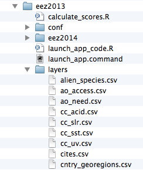

Note that each *.csv* file within the `layers` folder has a specific format that the Toolbox expects and requires. Comma separated value files (*.csv* files) can be opened with text editor software, or will open by default by Microsoft Excel or similar software. Open a `layers/*.csv` file: note the unique region identifier (*rgn_id*) with a single associated *score* or *value*, and that the data are presented in ‘long format’ with minimal columns. Please see the section on *Formatting Data for the Toolbox* for further details and instructions.


### *conf* folder
The `conf` folder includes includes R functions (*config.R* and *functions.R*) and *.csv* files containing information that will be accessed by the R functions (*goals.csv*, *pressures_matrix.R*, *resilience_matrix.csv*, and *resilience_weights.csv*).


#### *config.r*
`config.r` is an R script that configures labeling and constants appropriately.

#### *functions.r*
`functions.r` contains functions for each goal and sub-goal model, which calculate the status and trend using data layers identified as ‘layers’ in `layers.csv`. 

#### *goals.csv* 
`goals.csv` is a list of goals and sub-goals and their weights used to calculate the final score for each goal. Other information includes the goal description that is also presented in the Toolbox App. `goals.csv` also indicates the arguments passed to functions.R. These are indicated by two columns: *preindex_function* (functions for all goals that do not have sub-goals, and functions for all sub-goals) and *postindex_function* (functions for goals with sub-goals).  

#### *pressures_matrix.csv*
`pressures_matrix.csv` maps the different types of ocean pressures with the goals that they affect.  

Each column in the pressures matrix identifies a data layer that is also registered in `layers.csv`: these presssure data layers are also required to have a value for every region in the study area. Pressure layers each have a score between 0-1, and has its pressure category indicated by a prefix (for example: *po_* for the pollution category). 

#### *resilience_matrix.csv*
`resilience_matrix.csv` maps the different types of resilience with the goals that they affect.

Like the pressures matrix, the resilience matrix also has weights depending on the level of protection. However, these weights are in a separate file: `resilience_weights.csv`.

Each column in the resilience matrix is a data layer that is also registered in `layers.csv`. Resilience layers, like the pressure layers, are also requried to have a value for every region in the study area. Resilience layers each have a score between 0-1. 

#### *resilience_weights.csv*
`resilience_weights.csv` describes the weight of various resilience layers, which in Halpern et al. 2012 (Nature) were determined based on scientific literature and expert opinion.

### spatial folder 
The spatial folder contains a single file, *regions_gcs.js*. This is a spatial file in the JSON format; it has the appropriate study area and regions for the assessment. This file will be created by the OHI team for all regional assessments.

### *calculate_scores.r*
`calculate_scores.r` will run the Toolbox calculations using the *.csv* files in the *layers* folder that are registered in *layers.csv* and the configurations identified in *config.r*. Scores will be saved in *scores.csv*.

### scores.csv
`scores.csv` is a record of the calculated scores for the assessment (Global 2013 scores). Scores are reported for each dimension (future, pressures, resilience, score, status, trend) for each reporting region, and are presented in ‘long’ format. 


### Relaunching the Toolbox
After the initial Toolbox setup, further launches of the Toolbox Application can be done without the software program R. Instead, PC users can double-click the `launchApp.bat` file and Mac users can double-click the `launchApp.command` file.


# Using the Toolbox for a Regional Assessment

This page explains how to incorporate all of the pre-Toolbox decisions your team has made for your regional assessment into the OHI framework and your repository. Having a good understanding of how the Toolbox is structured can also help identify what must be modified for a regional assessment, particularly with data and models. This page assumes a good understanding of the Toolbox file system.  

The most common modifications you will make to your repository are:

- **modifying pressures and resilience matrices**
- **modifying and creating data layers for status, trend, pressures and resilience**
- **modifying goal models**
- **removing goals**


These changes are to be made in the following files (see below for more detailed instructions):


## Modifying pressures and resilience matrices

Previous decisions made with your team will identify if any pressures layers should be added to the pressures and/or resilience matrices, and if so, which goals the pressure affects and what weight they should have. Then, you can transfer this information into the Toolbox's `pressures_matrix.csv` and `resilience_matrix.csv` (located in the `[assessment]/[scenario]/conf` folder).


### Updating pressures_matrix.csv

`pressures_matrix.csv` maps the different types of ocean pressures (columns) with the goals that they affect (rows). Adding a new pressures layer to `pressures_matrix.csv` requires adding a new column with the pressure layer name. The name should be short but descriptive. The name should also include a prefix to indicate the pressure category. There are five physical categories and one social category:

* *po_* = pollution
* *hd_* = habitat destruction
* *fp_* = fishing pressure
* *sp_* = species pollution
* *cc_* = climate change
* *ss_* = social pressure  

For example, `po_trash` is a pollution layer with trash on beaches, and `sp_alien` is species pollution due to alien (invasive) species.

It is important to note that the matrix identifies the pressures relevant to each goal, and which weight will be applied in the calculation. But each pressure is a data layer, located in the `subcountry2014/layers` folder. This means that pressure layers need information for each region in the study area, and some layers will need to be updated with local data.  

### Updating resilience_matrix.csv

`resilience_matrix.csv` maps the different types of resilience (columns) with the goals that they affect (rows). New resilience layers may be added to `resilience_matrix.csv` based on finer-scale local information either in response to a new pressures layer, or as a new independent measure. Any added layer must be associated with a pressures layer that has a weight of 2 or 3 in the Ocean Health Index framework so that resilience measures can mitigate pressures in each region.

Each goal must have a resilience measure associated with it. In the figure below, the Toolbox would give an error because there are no resilience layers indicated for the natural products (NP) goal. 
  
  
  

## Modifying and creating data layers

### Overview

Data layers are *.csv* files and are located in the `[assessment]/[scenario]/layers` folder. All  layers provided in your regional assessment repo are the global values from the 2014 assessment. 

  

* Layers with the suffix `_gl2014.csv` (*gl* for *global*) have been exactly copied from the global assessment and applied equally to each region, and therefore the values will be the same across all subcountry regions. 
* Layers with the suffix `_sc2014.csv` (*sc* for *subcountry*) have been spatially-extracted from global data or adjusted with spatially-extracted data so that each subcountry region has a unique value. For example, gross domestic product (GDP) used in the global assessment was reported at the national (most often country) level. Instead of being applied equally across all subcountry regions (which would greatly increase the nation's GDP), national GDP was down-weighted by the proportion of coastal population in each region compared with the total coastal population.

Both types of dat layers are at coarse-resolution and should be exhanged for local, high-resolution data when possible. The priority should be to replace as much of the `_gl2014.csv` data as possible.

**There are several steps to follow when working with data layers:**

1. Modify or create data layer with proper formatting
2. Save the layer in the `layers` folder
3. Register the layer in `layers.csv`
4. Check (and update when appropriate) `pressures_matrix.csv` and `resilience_matrix.csv` (located in the `[assessment]/[scenario]/conf` folder)

### Create data layers with proper formatting

The OHI Toolbox App expects each data layers to be in its own .csv file and to be in a specific format, with data available for every region within the study area, with data organized in 'long' format (as few columns as possible), and with a unique region identifier (rgn_id) associated with a single score or value. 

The following is an excerpt from the 'Formatting data for the Toolbox' section above. For more information about formatting and gapfilling, please consult that section.

The example below shows information for a study area with 4 regions. There are two different (and separate) data layer files: tourism count (tr_total.csv) and natural products harvested, in metric tonnes (np_harvest_tonnes.csv). Each file has data for four regions (1-4) in different years, and the second has an additional 'categories' column for the different types of natural products that were harvested. In this example, the two data layers are appropriate for status calculations with the Toolbox because:

1. At least five years of data are available, 
2. There are no data gaps
3. Data are presented in 'long' or 'narrow' format (not 'wide' format).

**Example of data in the appropriate format:**


### Save data layers in the *layers* folder

When you modify existing or create new data layers, we recommend saving this as a new *.csv* file with a suffix identifying your regional assessment (example: `_israel2014.csv`). Modifying the layer name provides an easy way to track which data layers have been updated regionally, and which rely on global data. Template layers (`_gl2014.csv` and `_sc2014.csv`) can then be deleted.


  
### Register data layers in *layers.csv*  
  
When there are new filenames associated with each layer, they will need to be registered in `[assessment]/[scenario]/layers.csv`. If a layer simply has a new filename, only the *filename* column needs to be updated:
  
    
  
However, if a new layer has been added (for example when a new goal model is developed), you will need to add a new row in the registry for the new data layer and fill in the first eight columns (columns A-H); other columns are generated later by the Toolbox App as it confirms data formatting and content:

 + **targets:** Add the the goal/dimension that the new data layer relates to. Goals are indicated with two-letter codes and sub-goals are indicated with three-letter codes, with pressures, resilience, and spatial layers indicated separately.
 + **layer:** Add an identifying name for the new data layer, which will be used in R scripts like functions.R and *.csv* files like `pressures_matrix.csv` and `resilience_matrix.csv`.
 + **name:** Add a longer title for the data layer: this will be displayed in the Toolbox interface.
 + **description:** Add a longer description of the new data layer this will be displayed in the Toolbox interface.
 + **fld_value:** Add the appropriate units for the new data layer (which will be referenced in subsequent calculations).
 + **units:** Add a description about the *units* chosen in the *fld_value* column above.
 + **filename:** Add a filename for the new data layer that matches the name of the csv file that was created previously in the `layers` folder.
 + **fld_id_num:** Area designation that applies to the newly created data layer, such as: *rgn_id* and *fao_id*.

### Check pressures and resilience matrices

If the new or modified layer is a pressures layer, check again that `pressures_matrix.csv` and `resilience_matrix.csv` have been properly modified to register the new data. 


## Modifying goal models
In the discussion on data layers above, when an existing layer is still used as before but has a new *filename*, nothing further needs to be done for the Toolbox to incorporate this updated layer. However, if a new layer has been added to the `layers` folder and registered in `layers.csv` (and potentially added to the pressures or resilience matrices), the Toolbox will still not use it unless it is incorporated into a goal model.  
  
**There are several steps to follow when working with goal models:**

1. Update `functions.r`
2. Check and possibly update `goals.csv`

### Update *functions.r*

To incorporate a new data layer into a goal model, open `functions.R`: this script contains all the models for each goal and sub-goal. In RStudio, there is a navigation pane that can be used to navigate between them:


### Check and possibly update *goals.csv*

*goals.csv* provides input information for *functions.r*, particularly about goal weighting and function calls. It also includes descriptions about goals and sub-goals, which is presented in the Toolbox Application. 

Changing goal weights will be done here by editing the value in the *weight* column. Weights do not need to be 0-1 or add up to 10; weights will be scaled as a percentage of the goal totals. `goals.csv` also indicates the arguments passed to `functions.r`. These are indicated by two columns: *preindex_function* (functions for all goals that do not have sub-goals, and functions for all sub-goals) and *postindex_function* (functions for goals with sub-goals).


**When updating layers or goal models, it is important to ensure that information called from *goals.csv* is correct**: 

- check the years
- etc...


## Removing goals
If a goal is not relevant in your region, it is possible to remove the goal completely from the calculation. There are four places where you will need to remove the reference to this goal:

1. `functions.r`
2. `goals.csv`
3. `pressures_matrix.csv`
4. `resilience_matrix.csv`


## Example modifications

### Adding a new layer to a goal model

In this example we will walk through the following steps:

1. decide to add artisanal access component to the model because of locally available data
2. prepare the data file; save layer ao_access_art
3. register in `layers.csv`
4. update goal model in `functions.r`
5. update goal call in `goals.csv`

1) and 2) is done outside of the Toolbox

3. register in `layers.csv`


4. update goal model


5. [develop]


### Adding a new pressure layer
In this example there are two new pressure layers to include: the effects of desalination operations. The new layers are called *po_desal_in*, and *po_desal_out*.  

Adding these pressure layers to the Toolbox requires the following steps:

1. register (add) pressure layer(s) in `pressures_matrix.csv`
  + 1a set the pressure category  
  + 1b identify the goals affected and set the weighting
  + 1c modify the resilience matrix (if necessary) 
2. create pressure layer(s); save in the `layers` folder
3. register pressure layer(s) in `layers.csv`  


#### Register the new layers in `pressure_matrix.csv`.  

**1a.** This step should simply be transferring previous decisions made by your team into the Toolbox format. Create a data layer name with a prefix that signifies the pressure category (for example: *po_* for the pollution category). Each category is calculated separately before being combined with the others, so it is important to register the new pressure with the appropriate category prefix decided by your regional assessment team.  

**1b.** This step is also transferring prior decisions into the Toolbox format. Mark which goals are affected by this new pressure, and then set the weighting. Pressures weighting by goal should be based on scientific literature and expert opinion (3=high pressure, 1=low pressure). 


**1c.**

#### Create the new layers 

Suppose that there is information 

- for each region
- compliance reports
- rescale from 0 to 1
- save in `layers` folder

#### Register the new layers in `layers.csv`


### Updating resilience matrix with local habitat information

In this example we will borrow from the experience of `ohi-israel`, where they assessed habitats in the Habitats (HAB) sub-goal that were not included in global assessments `ohi-global`. Therefore, the resilience matrix may need some revision.  

The habitats assessed for `ohi-israel` are:

> `rocky_reef, sand_dunes, soft_bottom`

***Layers affected:***  

* resilience_matrix.csv
* resilience_weights.csv (only if adding new resilience layers)   

***Scripts affected:***  

* none (but may need to create a simple code to generate modified layers)   

***Default resilience layers:***   
The full list of layers used to calculate resilience in `ohi-global` are:

> `alien_species,  cites,  fishing_v1,  fishing_v1_eez,	fishing_v2_eez,	fishing_v3,	fishing_v3_eez,	habitat,	habitat_combo,	habitat_combo_eez,	li_gci,	li_sector_evenness,	mariculture,	msi_gov,	species_diversity,	species_diversity_3nm,	tourism,	water,	wgi_all`

Some of these layers capture general aspects of governance that apply to the protection of any habitat. These are:  

> `alien_species, cites, msi_gov, water, wgi_all`

Two layers only apply to the livelihoods and economies goal (LE), so they should be excluded from HAB resilience:

> `li_gci,  li_sector_evenness`

The remaining layers will apply to certain habitats, but not others. We focus on these to determine how to adapt the HAB resilience calculation for `ohi-israel`. They are:

> `fishing_v1, fishing_v1_eez, fishing_v2_eez, fishing_v3, fishing_v3_eez, habitat, habitat_combo,	habitat_combo_eez, mariculture, species_diversity, species_diversity_3nm,	tourism`

**To determine how to modify these resilience layers:**

* If the new habitat occurs only along the coast, we should use `tourism` and `species_diversity_3nm`, otherwise, only use `species_diversity`. 
    + `sand_dunes` should use `tourism` and `species_diversity_3nm`,
    + `soft_bottom` should use `species_diversity`,
    + is `rocky_reef` mainly coastal? if so it should use `tourism` and `species_diversity_3nm`.
* If the habitats can be affected by mariculture plants (e.g. eutrophication and decreased water quality can occur if mariculture plants are close by and have poor wastewater treatment), then the `mariculture` resilience score should be added.
    + are there any mariculture plants in Israel? If yes, on which habitats do they occur?
* The remaining layers are the `fishing_v...` and `habitat..` layers, these are composite indicators that we call 'combo' layers, obtained from different combinations of the following datasets:

> `Mora, Mora_s4, CBD_hab, MPA_coast, MPA_eez`,

where: 

* `Mora` is a fisheries governance effectiveness indicator by Mora *et al* (2009)
* `Mora_s4` is another indicator from Figure S4 of the supplementary material of the same publication that focuses on regulations of artisanal and recreational fisheries
* `CBD_hab` is a questionnaire compiled by countries that committed to Rio's Convention on Biodiversity (CBD) to establish their progress towards habitat biodiversity protection
* `MPA_coast` is the proportion of coastal (3nm) waters that are in a marine protected area (MPA), with the maximum being 30% of coastal waters 
* `MPA_eez` is the proportion of the whole EEZ that is in a marine protected area, with the maximum being 30% of the whole EEZ.  

This table shows which data-sets are used by each combo layer: 

Layer | Mora | Mora_s4 | CBD_hab | MPA_coast | MPA_eez
------|------|---------|---------|-----------|--------
fishing_v1 | Mora | | CBD_hab | MPA_coast | 
fishing_v1_eez | Mora | | CBD_hab | | MPA_eez
fishing_v2_eez | Mora | Mora_s4 | CBD_hab | | MPA_eez
fishing_v3 | | Mora_s4 | CBD_hab |  MPA_coast | 
fishing_v3_eez | | Mora_s4 | CBD_hab | | MPA_eez
habitat | | | CBD_hab | | 
habitat_combo | | | CBD_hab |  MPA_coast | 
habitat_combo_eez | | | CBD_hab | | MPA_eez

**Questions to consider**:

1) For which habitats should you use both a fishery and a habitat combo, or just use a habitat combo?
* fisheries regulations do not affect the conservation of sand-dunes, so this habitat should not use any of the fisheries combos. Also, this is a strictly coastal habitat, so choose the habitat layer that uses the `MPA_coast` instead of the `MPA_eez`, i.e. `habitat_combo` (and, as mentioned above, choose the coastal version of biodiversity, i.e. `species_diversity_3nm`).
* The rocky reef and soft bottom, on the other hand, should definitely include fisheries regulations. So you'll need to choose a fisheries and a habitat combo for these two habitats.
2) Which fisheries and habitat combos for `rocky_reef` and `soft_bottom`? The choice depends on two things:
* whether they are coastal habitats (within 3nm of the coast) or EEZ-wide habitats     
      + if coastal, use the fisheries and habitat combos with `MPA_coast` (`fishing_v1`, `fishing_v3`, `habitat_combo`), and the `species_diversity_3nm` layer   
      + if EEZ-wide, use the fisheries and habitat combos with `MPA_eez` (`fishing_v1_eez`, `fishing_v2_eez`, `fishing_v3_eez`, `habitat_combo_eez`), and the `species_diversity` layer
* whether the fisheries occurring on that habitat are mainly artisanal, mainly commercial, or both
    + if only commercial fisheries, use a layer that only uses the `Mora` data `fishing_v1..`)
    + if only artisanal/small-scale fisheries, use a layer that only uses the `Mora_s4` data (`fishing_v3..`)
    + if both, use a layer that uses both `Mora` and `Mora_s4` data (`fishing_v2..`)
3) Are the existing combo layers appropriate or do you need an ad-hoc version for any of the Israel habitats? 
* if rocky reef is mainly coastal, and it is fished by both commercial and artisanal methods, then we need a new combo, specifically, we need a combo that uses `Mora`, `Mora_s4`, `CBD_hab`, and `MPA_coast` (this is the same as `fishing_v2_eez`, but we use the `MPA_coast` layer instead of the `MPA_eez`). All other combinations are already present.
4) Are there local data to be used?
* if there are local data on Marine Protected Areas (MPAs) and any areas with special regulations, this should be used to generate the `MPA_coast` and `MPA_eez` layers. \*\*NOTE: these are the same datasets used to calculate the status of Lasting Special Places (LSP).
5) How to update `resilience_matrix.csv`?
* write the complete list of layers you want to use for each habitat. Based on the above, for example, `soft bottom` in Israel matches the combination of layers called *soft bottom, with corals* in the default `resilience_matrix.csv`. But the `rocky_reef` and `sand_dunes` don't seem to match any existing combination, so you'll probably need to delete some of the rows, e.g. the *coral only*, and replace with new ad-hoc rows.

### Removing a goal

1) Remove the carbon storage (CS) goal model from `functions.r`:


2) Remove the CS row from `goals.csv`:


3) Remove all CS rows from `pressures_matrix.csv`:


4) Remove all CS rows from `resilience_matrix.csv`:


### Preparing the fisheries sub-goal 

Here is some background information about how to prepare fisheries data layers for the Toolbox.

**Data layers used by the Toolbox:**

* `fis_b_bmsy`
* `fis_meancatch`
* `fis_proparea_saup2rgn`
* `fp_wildcaught_weight`

#### Description of data layers

`fis_b_bmsy`

* *for species*: B/Bmsy estimate (either from formal stock assessment, or from a data-poor method such as CMSY)    
* *for genus/family/broader taxa*: the toolbox will use median B/Bmsy from species in that region + a penalty for not reporting at species level. In order for the code to assign the correct penalty, the taxa need to include a numerical code of 6 digits, where the first digit behaves like an ISSCAAP code (the standardized species codes used by FAO): 6 means species, 5 means genus, 4 to 1 are increasingly broad taxonomic groups    
* *data source (for CMSY)*: catch time-series (at least 10 years of catch >0), species resilience (if available)  

**Example data:**

|fao_id |taxon_name     |year |b_bmsy   |
|:------|:--------------|:----|:--------|
|51     |Ablennes hians |1985 |1.112412 |
|51     |Ablennes hians |1986 |1.222996 |
|51     |Ablennes hians |1987 |1.371058 |


NOTE: if a species that is caught in different sub-regions belongs to the same population, you don't want to split the catch among sub-regions, instead, you want to sum catch across all sub-regions, so you can calculate B/Bmsy for the whole population. For the global analysis we grouped all species catch by FAO major fishing area (www.fao.org/fishery/area/search/en), indicated in the column *fao_id*, assuming that all species caught within the same FAO area belonged to the same stock, while we assumed that the same species, if caught in a different fishing area, belonged to a separate stock.  
Use *fao_id* as an identifier that separates different fisheries 'stocks' belonging to the same species.   
If you don't have multiple stocks in your study area, set all *fao_id* = 1.  

`fis_meancatch`:

* average catch across all years, per species, per region  
* *data source*: catch time-series (at least 10 years of catch >0), with a unique identifier for each population that you want to assess separately   
 
**Example data:**

|fao_saup_id |taxon_name_key             |year |mean_catch  |
|:-----------|:--------------------------|:----|:-----------|
|37_8        |Aristeus antennatus_690051 |2014 |14.24398116 |
|37_8        |Atherinidae_400218         |2014 |27.30120156 |
|37_8        |Balistes capriscus_607327  |2014 |3.247883895 |

The *taxon_name_key* column indicates the name of the species (e.g. Aristeus antennatus) and its 'taxonkey'. The taxonkey is a 6 digit numeric code used by the Sea Around Us Project, modified from FAO codes. The important element of this code is the first digit, because it reflects the taxonomic level (6=species, 5=genus, 4=family, etc.) of the reported catch.The toolbox uses this first digit to assign a score to all catch that was not reported at species level, taking the median of the B/Bmsy of assessed species, and adding a penalty that is increasingly strong for coarser taxa.    

`fis_proparea_saup2rgn`:  

* a conversion file that, for each region for which catch is reported, tells us what proportion of that region falls within each of the final OHI reporting regions.   

**Example data:**

| saup_id| rgn_id| prop_area|
|-------:|------:|---------:|
|     166|      1|       1.0|
|     162|      2|       1.0|
|     574|      3|       0.7|
|      37|      4|       0.8|

**Specific instances:**

 *only if catch is reported for different regions than the ones used for the OHI assessment:* this should be calculated using spatial analyses of overlap of the spatial units at which catch is reported with the spatial units at which the OHI assessment will be reported. The global data was reported by subregions (*saup_id*) and in some cases multiple subregions were part of the same, larger EEZ. Since for OHI we wanted results by EEZ (*rgn_id*), in those cases we needed to combine results from the subregions to get the final score, based on their size relative to the total EEZ size (*prop_area*).   
 *If catch is reported for the same areas for which OHI is calculated:* then all the *prop_area* are = 1.   
 *If catch is reported for the whole area of the assessment, but you want to calculate a separate OHI score for different sub-regions:* for each OHI reporting region (*rgn_id*) you'll repeat the same region in the *saup_id* column, and *prop_area* will be =1. This effectively means all the reporting regions will get assigned 100% of the catch and will have the same final stastus and trend score for the fisheries goal (but may have different pressures and resilience scores, if those layers are different in each sub-region).  

`fp_wildcaught_weight`: 

*only needed if there is mariculture*: for each region, this represents the relative proportion of catch coming from wild caught fisheries versus mariculture. The layer is used to weight how much the fisheries score influences the final food provision score, the higher the fisheries catch, the more the food provision score will reflect the fisheries score, and vice-versa if mariculture has a higher catch.       
(NOTE that, before all mariculture harvest from all species gets summed, the mariculture harvest for each species is smoothed and then multiplied by the resilience score).     

#### Running CMSY model

**Sample data to run CMSY:**

|id |stock_id                    |res    |ct          |yr   |
|:--|:---------------------------|:------|:-----------|:----|
|6  |Acanthistius brasilianus_41 |Medium |100         |1950 |
|23 |Acanthurus dussumieri_61    |       |0.059250269 |1950 |
|24 |Acanthurus dussumieri_71    |       |0.190749971 |1950 |
|25 |Acanthurus lineatus_61      |Low    |12.74821966 |1950 |

The current CMSY script produces an output that looks something like this (split into 2 tables): 

|stock_id          |convergence |effective_sample_size |yr   |b_bmsy   |b_bmsyUpper |
|:-----------------|:-----------|:---------------------|:----|:--------|:-----------|
|Ablennes hians_51 |SC          |30974                 |1985 |1.112412 |1.8         |
|Ablennes hians_51 |SC          |30974                 |1986 |1.222996 |1.768895    |

|stock_id          |yr   |b_bmsyLower |b_bmsyiq25 |b_bmsyiq75 |b_bmsyGM |b_bmsyMed |
|:-----------------|:----|:-----------|:----------|:----------|:--------|:---------|
|Ablennes hians_51 |1985 |1           |1          |1          |1.093932 |1         |
|Ablennes hians_51 |1986 |1.014688    |1.075699   |1.298437   |1.209005 |1.160329  |

where *stock_id* is the unique identifier for each stock that was used in the input file, *convergence* indicates whether the model converged and how strongly ('SC' = strong convergence), *effective_sample_size* reports the number of iterations used, *yr* = year, b_bmsy = B/Bmsy for the corresponding year (based on the median of all the estimated values: reccomended),  b_bmsyUpper = B/Bmsy at the upper 95% bootstrapped confidence bound, b_bmsyLower = B/Bmsy at the lower 95% bootstrapped confidence bound, b_bmsyiq25 = B/Bmsy at the first quartile, b_bmsyiq75 = B/Bmsy at the third quartile, b_bmsyGM = B/Bmsy based on the geometric mean of estimates, b_bmsyMed = B/Bmsy based on the median of estimates.

**How to:** 

**1. Include resilience in the CMSY code:**

In the CMSY R script, in the PARAMETERS section, replace the following:

```
start_r     <- c(0.01,10)  ## disable this line if you use resilience  
with 

  if(res == "Very low"){
    start_r  <- c(0.015, 0.1)
  } else { 
    if(res == "Low"){
      start_r  <- c(0.05,0.5)
    } else { 
      if(res == "High"){
        start_r  <- c(0.6,1.5)   
      } else {
        start_r  <- c(0.1,1)
      }
    }
  }
```

**2. Make assumptions about fisheries regulations:**

If you assume that fisheries are depleted and there isn't very much fisheries regulation, and you are using the CMSY method to assess B/Bmsy, the original model may work well. If, however, the catch of a species declined because fisheries regulations have closed or limited the fishery, or if a fishery was abandoned for economic reasons (e.g., change in consumer prefereces, market price dynamics, etc.), the model may be too pessimistic and understimate B/Bmsy. In that case it may be best to use a version with a uniform prior on final biomass, instead of the constrained prior.  
The original constrained prior on final biomass is set by this line within the code:  
  
```
finalbio    <- if(ct[nyr]/max(ct) > 0.5) {c(0.3,0.7)} else {c(0.01,0.4)}    
```  

The model uses a uniform prior if that line is replaced with:

```
finalbio    <- c(0.01,0.7) 
```

**3. Use data at a different spatial resolution than the final assessment:**

See notes above for `fis_proparea_saup2rgn`

**4. Calculate B, or Bmsy:**

The CMSY model calculates B/Bmsy as a ratio, it does not estimate the two variables separately.      

**5. Use catch per unit of effort (CPUE):**

The CMSY model requires total biomass removed by fisheries, and uses catch as a proxy for that. It cannot use CPUE. Other more sophisticated stock assessment models use CPUE and may be employed. We do not provide documentation for the use of these other models.     

**6. Use other life-history characteristics, in addition to resilience:**

The CMSY model does not use more detailed information. Other more sophisticated stock assessment models use other life-history traits such as fecundity, larval dispersal, r, K, Lmax, etc., and may be employed. We do not provide documentation for the use of these other models.    

**7. Create a 'taxonkey' to assign to each species:**

When replacing the SAUP_FAO data with your own data, assign a key of 600000 to all species. For all catch that is reported at genus or coarser taxonomic level, you will have to choose an appropriate taxonkey. You can create your own key, from 100000 to 500000, based on your own judgment of how many species may be reported under that same denomination, and how different they may be (all that matters for the toolbox code is whether the number starts with a 1,2,3,4,5 or 6 with 1 being the coarsest, such as 'miscellaneous marine animals', or 'crustaceans nei'). 

#### Resources

Martell, S & Froese, R (2013) "A simple method for estimating MSY from catch and resilience". *Fish and Fisheries*, DOI: 10.1111/j.1467-2979.2012.00485.x. [Downloadable here](http://www.google.com/url?sa=t&rct=j&q=&esrc=s&source=web&cd=2&ved=0CCkQFjAB&url=http%3A%2F%2Fwww.iotc.org%2Fsites%2Fdefault%2Ffiles%2Fdocuments%2F2013%2F06%2FIOTC-2013-WPNT03-INF01%2520-%2520Martell%2520%2526%2520Froese%25202012.pdf&ei=PXryU6TtGY3goATglYHoDA&usg=AFQjCNE-S0T1B7B_l7rUYaNNLxsUDguDaQ&bvm=bv.73231344,d.cGU)   
     
Rosenberg, A.A., Fogarty, M.J., Cooper, A.B., Dickey-Collas, M., Fulton, E.A., Gutiérrez, N.L., Hyde, K.J.W., Kleisner, K.M., Kristiansen, T., Longo, C., Minte-Vera, C., Minto, C., Mosqueira, I., Chato Osio, G., Ovando, D., Selig, E.R., Thorson, J.T. & Ye, Y. (2014) Developing new approaches to global stock status assessment and fishery production potential of the seas. *FAO Fisheries and Aquaculture Circular No. 1086*. Rome, FAO. 175 pp. [Downloadable here](http://www.fao.org/docrep/019/i3491e/i3491e.pdf)

## Notes about R

The Toolbox is written in R, and relies heavily on a few R packages created to faciliate data handling and manipulation. The primary R package used is called `dplyr` by Hadley Wickham. The `dplyr` package allows for 'chaining' between functions, which is represented with a `%>%`. See: https://github.com/hadley/dplyr#dplyr for documentation. 


# Frequently Asked Questions (FAQs)

This document provides answers to some frequently asked questions about conducting regional assessments using the Ocean Health Index. A few questions are related to general concepts in the Ocean Health Index, but mostly those topics are covered at http://www.oceanhealthindex.org/About/FAQ/. Here, the FAQ are primarily technical questions regarding regional assessments and using the OHI Toolbox. This document will be updated continually as we have more questions. Questions are arranged by theme, and have the format Q: (question) and A: (answer). 

## Overall

## Conceptual

**Q: Are regional assessment scores comparable with global assessment scores?**

A: Regional Index scores cannot be directly compared to global Index scores, or to other regional Index scores calculated through separate efforts. This is because data and indicators (both what they measure and their quality), reference points (set using local knowledge and priorities), and specific goal models are often different for the areas being compared.
 
However, because scores for each goal are scaled to a reference point, qualitative comparisons can be made. For example, a score of 71 in the US West Coast compared to 66 in Brazil says that the US West coast is closer to fully meeting its sustainable goals (i.e., meeting regional reference points). Furthermore, use of the same Ocean Health Index framework across regional assessments permits fruitful discussion and general comparisons even if data inputs differ. Ocean Health Index assessments at any scale always work within a standardized definition of ocean health, using information to capture the philosophy of the ten goals that have been identified (and undergone scientific peer-review) prior to compiling relevant data. Use of the ten-goal framework is important both to ensure that all aspects of ocean health are captured and to allow better comparison across regional assessments than would be possible if the different regions used different methods.


**Q: Where is climate change measured in the Index?**

A: Four different aspects of climate change -- increases in sea surface temperature (SST), sea level rise (SLR), ultraviolet radiation (UV), and ocean acidification (OA) -- are included as pressures to many goals in the Index, including Natural Products, Carbon Storage, Coastal Protection, Sense of Place, Livelihoods & Economies and Biodiversity.  Mitigation of climate change through carbon storage is one of the ten goals.


**Q: Why are food provision and artisanal fishing opportunities goals separated?**

A: These goals measure different aspects of how people relate to fishing. The catch of fish made by artisanal (=small-scale, subsistence type) fisheries is captured in the food provision goal. Jobs, wages and income from both the food provision and artisanal fishing goals are captured in the livelihoods & economies goal. The purpose of the artisanal fishing opportunity goal is to evaluate the opportunity for people to pursue this fishing in relation to their need to do so.  

## Timing and Resources

**Q: How much does it cost to produce a regional assessment?**

A: Regional assessments can be completed at(varying costs depending on the local context.(Funds are needed for a management and scientific team, workshops and meetings (including travel), communications, policy engagement, and operating costs. Therefore, securing funding is an important component to satisfactorily complete the assessment. We encourage the development of a local proposal or strategic action plan that details a timeline of activities and the resources needed to accomplish them.


**Q: How many people are required in a team?**

A: rather than a specific number of individuals, what is required are specific skillsets. For example, if the scientific analysts were capable of effectively conducting the R analysis, then a dedicated R analyst would not be required. In current assessments, teams range between 2 and 8 people.


**Q: How long does it take to calculate OHI at a regional scale?**

A: This depends on many things: budget and number of people involved, the scale of the study area and whether new regions will need to be created, how easily data can be acquired, how much local data can be incorporated, how many goal models need to be changed. Additionally, decisions about setting reference points require input from experts.


**Q: How much time will modifications by an R analyst take?**

A: This will depend on if you are changing any models, and potentially data layers--but a lot of changing data layers just requires registering them properly in layers.csv (and maybe pressures_matrix.csv and resilience_matrix.csv if they are pressures or resilience files) and having the functions.r file call those layers. That is more 'bookkeeping' than actual R programming. 


**Q: How much time will modifications by a GIS analyst take?**

A: this will depend on how many layers you are processing: you are clipping spatial data? That will take some time because there are quite a few files, but maybe not too long since it is pretty small scale and once there is a clipping mask created I think you apply it to other files. 


**Q: Which goals require a GIS analyst?**

A: All goals using spatial data could potentially require a GIS analyst. These goals are commonly: habitat-based goals and sub-goals: (Coastal Protection, Carbon Storage, Habitats—a sub-goal of Biodiversity), Food Provision, Sense of Place, Species—a sub-goal  of Biodiversity, Clean Waters

## Structure

**Q: Can we remove or add goals to the OHI?**

A: A lot of deliberation went into defining the ten goals, and they seem to do a pretty good job of covering many if not most ocean uses, so additional goals may not be necessary. But it could be that they eclipse or replace an existing goal. 

## Reference points

**Q: Can planning targets can be used as the reference points?**

A: Yes, planning targets can be used as reference points. This won't be appropriate for every goal, but there are cases where this seemed best (example: iconic species sub-goal in the global assessment, mariculture sub-goal in the US West Coast assessment). 


**Q: What is sector evenness?**

A: Sector evenness (also called a diversity index) is an economic concept that is included in OHI to enable comparison across many different sectors included in the Livelihoods & Economies goal. This goal evaluates jobs, wages and revenues for nine marine employment sectors. The distribution of employment across these nine sectors is an effective indicator of resilience. If total employment within a community is primarily based in one or two sectors, the overall economic system will be excessively vulnerable to downturns in those sectors.  Conversely, if employment is spread relatively evenly throughout all nine sectors, the overall system will be more robust and resistant to such disturbances. Overall revenue within the community will remain more stable during such downturns, and workers displaced by a downturn in their sector may be able to find employment in another sector without leaving the community. 

## Appropriate data layers

**Q: Shipping and port activity are hardly affected by the health of the ecosystem. Why are these included in the Index?**

A: Shipping and port activity are included as pressures only


**Q: Can oil spills be included in OHI?**

A: Yes, oil spills could be included as a pressure and in the Clean Waters goal.


**Q: Is seasonal (non-permanent) sea ice included in OHI habitats?**

A: No, sea ice only includes permanent sea ice.


**Q: Can seaweeds be included in the Carbon Storage goal?**

A: Because they store carbon for less than 100 years, seaweeds and corals are not included in the carbon storage goal. While the pelagic oceanic carbon sink (phytoplankton) plays a large role in the sequestration of anthropogenic carbon, the pelagic ocean mechanisms are not amenable to local or regional management intervention. Phytoplankton and contribute to carbon fixation when they die and sink to the sea bottom at sufficient depth, because it is effectively out of circulation. However, if those phytoplankton are eaten, the carbon is cycled back into the system and not sequestered. Something that could potentially be included in the carbon storage goal is mollusc shells, if they are added to a landfill and not recycled in the sea. So if information on mariculture production and waste disposal are available, this could be an interesting addition to carbon storage at a regional scale.


**Q: Is coastal engineering included in Coastal Protection? What if it reduces erosion?**

A: We did not include an assessment of the protection afforded by  man-made structures, such as jetties and seawalls, because these structures cannot be preserved without maintenance, may have other negative side effects (e.g. alter sedimentation rates causing erosion in new locations), thus they do not constitute long-term sustainable services. 
Coastal engineering (jetties, harbours, marina and breakwater) is not natural, and is mostly seen as a pressure. It will also be evident in the status of due to decreased natural habitat. It gets tricky when structures are built to help reduce coastal erosion--they are still manmade and therefore not a natural benefit that the ocean provides. But if available data allow, it might be possible to include tradeoff effects: maybe in areas where natural habitats are degraded and man-made structures have been built to reduce erosion, we could reduce the pressure that would otherwise be applied.


**Q: How is seawater used for cooling on-shore power plants incorporated into OHI?**

A: The use of cooling water for on-shore power plants would be a pressure on the ocean, since it causes entrapment of fishes, larvae, etc, and usually is circulated back into the ocean at higher temperatures (and maybe other chemicals, minerals, etc). Since the energy is coming from land-based activities, there isn't a service that the ocean is providing that 'benefits' people, it is only a pressure from the OHI perspective.


**Q: How is freshwater production through desalination incorporated into OHI?**

A: Desal would be incorporated into OHI in several places. The benefit is that there is freshwater produced, which could be incorporated into the Natural Products goal (or potentially into its own goal). Data required would be the volume of freshwater created based on the volume of seawater involved and spatial extent. Setting the reference point would not be based on how much can be produced, but some other targets perhaps set by government (percentage of the population served). 
Similar to the mariculture sub-goal and tourism goals, any negative effects caused by desal that affect other goals (example: species) do not influence the ability to obtain desalination targets now and in the future. Therefore, the sustainability coefficient only measures the ability to sustain that goal, but not the impacts on other goals: instead, they are taken into account as pressures when calculating the other goals. Desal should be included as a pressure similar to cooling on-shore power plants since the discharge brine is dense, doesn't plume very well and there are chemicals involved. 

## Food Provision

**Q: Could the culture of marine fish in closed pools on-shore be included in the Mariculture sub-goal?**

A: This should not be included because onshore aquaculture does not require a marine environment.


**Q: Can aquaculture farms that receive seawater supply and return seawater back to the sea be included in the food provision goal?**

A: This would be more appropriately included in the Mariculture sub-goal, and with finer-scale data additional pressures due to the intake pipes and the processed brine back into the marine system could be incorporated as well. 
Natural Products


**Q: If natural products are all produced through on-land aquaculture, should this goal be removed?**

A: In this case you would probably have good reason to exclude the natural product goal due if this was defendable through discussions with experts and any reports/papers on the topic. This would also depend on the origin of these natural products--are they from the region’s waters?
Habitat-based goals


**Q: How is coral health calculated?**

A: Coral health was estimated by compiling point data from multiple studies of percent live coral cover. In other words, estimates of coral cover within transects of certain sites were repeated in time and we used that rate of change in time as an indication of health of the reefs in the whole region. The difficulty lies in 1) having enough different locations sampled that you can say something about the whole region and 2) finding studies that did repeated measures in time, in the same location, over at least 20 years. In the Global 2013 assessment, there were so few datasets that satisfied this condition that we had to pool observations from different locations. 


**Q: Is it possible to calculate habitat goals when there is only one year of habitat data?**

A: With only one year of habitat data, it is not possible to calculate the trend (which requires 5 years of data). Instead, it might be best to use the available habitat data to calculate the current status and then to overlay pressures for the last 5 years to calculate trend. 

## Livelihoods & Economies

**Q: Benefits gained from Wild-caught fisheries, Mariculture, Tourism & Recreation are included in specific goals. Why are these counted again in Livelihoods & Economies?**

A: The quantity of fish, mariculature, and participation in T&R are considered separately in goals whereas the monetary component is captured in L&E.


**Q: Why are revenue data from shipping, boat building, ports and harbors included as revenue? Do these activities rely on a healthy ocean?**

A: These sectors are included in the Ocean Health Index because the demand for some of those boats (fishing boats, sailboats, yachts) is dependent on a healthy ocean.


**Q: Why isn’t oil and gas industries included in revenue?**

A: The Natural Products goal does not include non-living items such as oil, gas, and mining products, because these practices are not considered to be sustainable. They are also done at such large scales that including them would essentially make OHI an index for oil and mining--and they are not truly an ocean product. Because these products are not included in terms of quantity extracted, it did not seem appropriate to include information regarding jobs, wages or revenue. 

## Tourism & Recreation

**Q: How do I calculate the sustainability term for TR?**

A: The best way is to use a local indicator or measure of tourism sustainability or competitiveness, otherwise use the TTCI value from the Global 2013 assessment for the study area (applied evenly across all regions.

## Natural Products

**Q: Where do Natural Products come from?**

A: In the global assessments, Natural Products data come from the UN’s Food and Agriculture Administration (www.fao.org/fishery/statistics/software/fishstatj/en). These data are compiled and reported by product for each country, and available by downloading the FishStatJ software.

## Sense of Place

**Q: Data are only available for marine protected areas, not terrestrial protected areas. Can we still calculate the Lasting Special Places sub-goal?**

A: Yes, it is possible to calculate only the marine component of this sub-goal: this is not ideal but OHI is flexible to work with the data available.

## Pressures

**Q: How are single ecological pressures (si in Equation S8) calculated?**

A: Data included in pressures calculations are accessed in the same manner as any other data layer, and rescaled from 0-1 with an appropriate reference point. For further information, see HowTo_GatherAppropriateData and HowTo_CalculatePressures from ohi-science.org.


**Q: Does the pressures matrix need to be changed?**

A: It is likely that the pressures matrix will not need to be changed. The weights assigned in the matrix were set using information from the literature and by experts; the matrix was created by Halpern et al. 2012. 


**Q: How is commercial high and low bycatch calculated?**

A: Commercial high and low bycatch are categorical values that were set based on fishing gear type. This began as a list of gear types used, producing a range of potential bycatch frequencies (from local reports when possible), which can be rescaled.


# Toolbox Troubleshooting

The Toolbox prints messages during its processing to help guide error checking and debugging. Here are a few troubleshooting tips. This section will be updated frequently; please share any problems that you encounter.  


## Loading RWorkspace on Restart

When you restart your R Session (Session > Restart R on a Mac), if you see that it is trying to load `ohicore`, it may give you an error:

  > 
  
You do not want it to load `ohicore` or to save anything in your workspace. You will need to change the default setting from you **.Rproj** file. Steps to do this:

1. Go to Project Options, either in the pull-down menu or by double-clicking the .Rproj file:
   

  > 
  
  > 
  
2. Change all options to **No:**
    
  > 
    
## Calculating Pressures...

### 'The following components for [goal] are not in the aggregation layer [layer]...'

Example:
```
Running Setup()...
Calculating Pressures...
The following components for NP are not in the aggregation layer np_harvest_product_weight categories (fish_oil, ornamentals, seaweeds): corals, shells, sponges
Error in data.frame(names(P), P) : 
  arguments imply differing number of rows: 0, 1
```  
  
  >   
  
This error means you should update your pressures matrix because it expects there to be components that your region does not have.

### 'Error in matrix...'

Example: 
  >   
  
This error means there is an empty column in `pressures_matrix.csv`, and the Toolbox cannot handle empty columns.

## Calculating Resilience ... 

### 'Error in match(x, table, nomatch = OL) : object id_num not found'

  >   

This error means you should check that there is at least one entry for each goal (for each row) in `resilience_matrix.csv`.

