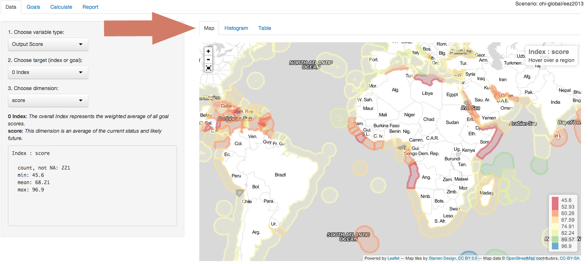
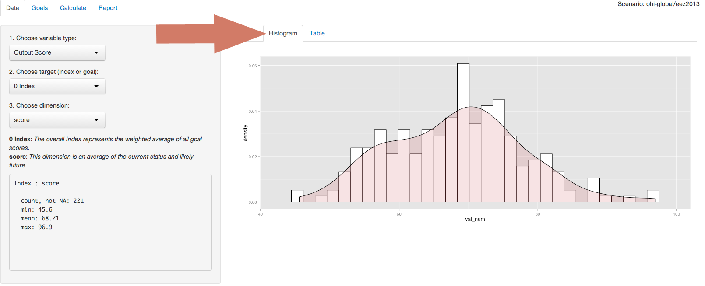
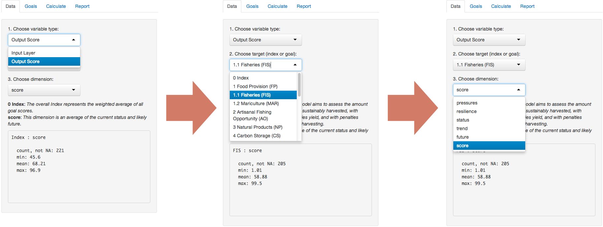
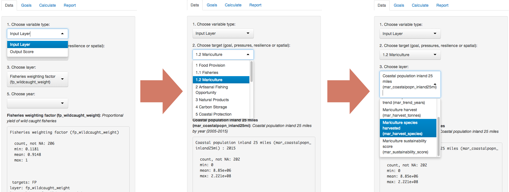

## Using the OHI Toolbox App
The Toolbox App runs through a web browser and has four page options: *Data*, *Goals*, *Calculate*, and *Report*. The [*Data*](https://github.com/OHI-Science/ohimanual/blob/master/tutorials/toolbox_manual/using_the_ohi_toolbox_app.md#data-page) page provides several ways of viewing the data (*Map*, *Histogram*, *Table*).  The [*Goals*](https://github.com/OHI-Science/ohimanual/blob/master/tutorials/toolbox_manual/using_the_ohi_toolbox_app.md#goals-page) page summarizes the global data, and weights for various goals can be adjusted.  The [*Calculate*](https://github.com/OHI-Science/ohimanual/blob/master/tutorials/toolbox_manual/using_the_ohi_toolbox_app.md#calculate-page) page will calculate goal scores based on the information in the filesystem (data can be changed and tested). The [*Report*](https://github.com/OHI-Science/ohimanual/blob/master/tutorials/toolbox_manual/using_the_ohi_toolbox_app.md#report-page) page provides different methods of reporting the data.

## Data Page
The Data page displays the scores for each goal parameter as well as the data layers used to calculate these parameters, and presents the information as a Map, Histogram, or Table.

  * Data displayed in [Map](https://github.com/OHI-Science/ohimanual/blob/master/tutorials/toolbox_manual/using_the_ohi_toolbox_app.md#map) form:
  

  * Data displayed in [Histogram](https://github.com/OHI-Science/ohimanual/blob/master/tutorials/toolbox_manual/using_the_ohi_toolbox_app.md#histogram) form:
  

  * Data displayed in [Table](https://github.com/OHI-Science/ohimanual/blob/master/tutorials/toolbox_manual/using_the_ohi_toolbox_app.md#table) form:
  

### Overview of variable options

In the Data Page are drop-down menus from which the user chooses:

1. **variable type**
    + *Output layer: Shows the calculated score*
    + *Input Layer: Shows the data layer used to calculate the score*
2. **target** 
    + *Overall Index*
    + *Ten Goals*
    + *Eight Sub-goals*
3. **dimension** (for score variables) or layer (for data layer variables)
4. **category** (this will appear for data layer variables with categories)
5. **year** (this will appear for data layer variables with multiple years)

The options to choose depend on what the user sets as the variable type. 

**For example:**

> **Output layer > Fisheries > Score**
shows the final calculated score for the fisheries sub-goal in 2013.

> **Input layer > Mariculture > Mariculture species harvested**
shows the different harvested species that were used to calculate the mariculture sub-goal.

The options to choose depend on what the user sets as the variable type:

#### Output score
If the user selects ‘Output Score’ as the variable type (which is the default), they will then be able to choose a target and a dimension. The target identifies the scale of reporting (goal/sub-goal) and the dimension indicates the calculation to be reported.

* Target options (with numeric identifiers):
    + Overall Index
    + Ten goals and eight sub-goals
* Dimension options:
    + Status, trend, future state, pressures, resilience, and score
    
#### Input layer
If the user selects “Input Layer” as the variable type, they will be able to choose a target and a specific layer that is associated with that target. If that layer has multiple categories or years available, the user will be able to select a preference, with a default being the first category alphabetically and the most recent year.

* Target options (with numeric identifiers):
    + Ten goals and eight sub-goals
    + Pressures
    + Resilience
    + Spatial
* Layers options:
    + Specific data layer associated with the target
* Category options:
    + This option will appear if the layer identified has categories
* Year options:
    + This option will appear if the layer identified has multiple years

### Overview of display options
The default display option for the Data page is Map view; Histogram and Table views are also possible. These options are presented as tabs located above the map. For all visualization options, statistics and metadata are displayed below the drop-down menus on the left side of the page.

### Map 
The map displays data for every region as reported in the 2013 global assessment.

Zooming in and out is possible with the plus/minus in the upper left of the map, and a color legend is displayed in the lower right corner of the map. The legend provides a linear colormap of the data and the range of values will update with each new selection. 

The target and dimension chosen from the drop-down menu is also displayed as text on the top right corner of the map. Below this information, the region name, (region number), and value appears if the user’s mouse is over a specific region. When the value of that region is displayed, the region will darken on the map. If the mouse is not indicating a specific region, this area will instruct to ‘hover over a region’.

### Histogram
The histogram shows the distribution of the selected variable as the number of observations per value bin (white bars) and a smoothed density function (pink shading). 

 + For example, if the **Output Score > Fisheries > score** sub-goal is selected, the information displayed by the histogram is as follows:

### Table
The table displays the target value for each region and the overall study area. It provides an identifying code (rgn_id), name (rgn_name), and value (value) for each.

It is possible to search the data using the search bar at the upper right of the table (Caps-sensitive). It is also possible to search within individual columns by entering the search term at the bottom of each column; this option is more easily displayed by changing the number of records per page to 10 using the drop-down menu. Data may also be sorted the arrows at the left of each column name. Sorting by rgn_id is the default.

## Goals Page
Flower diagrams are used to visualize calculated scores for each region and the overall study area. The number in the center of the diagram is the overall score for the region, and each petal represents a goal or sub-goal. The length of each petal reflects the score for the goal or sub-goal. Goal and sub-goal scores are on a scale from 0 to 100, with 0 being worst (no visible petal) and 100 being best (petal length extends to the outer ring). This score is also written outside of the diagram along with the goal or sub-goal identifier. The width of the petal reflects the weighting of a goal or sub-goal relative to the other goals and sub-goals.  The default flower diagram displays each goal with equal weighting (10%), with sub-goals contributing equally to each goal (5%).

The Goals page allows the user to change the goal weights, influencing the overall score. While the score for each individual goal remains unchanged (the petal length stays the same), changing the relative contribution of each goal score does influence the overall index score (the petal width changes). For example, if a goal that scores poorly is assigned a bigger weight, this will cause the overall score to decrease.

To change goal weightings, use the mouse to slide the weights across any of the goals and see how the flower diagram changes. Currently, other goal weights will change in order to ensure that all weightings equal 100%. In future iterations of the Toolbox App there will be more control over how to set these settings.

## Calculate Page
The Calculate page is used to calculate the Index. 
If the user is only exploring the results from the global assessment and followed the Toolbox App [installation](http://ohi-science.org/pages/install.html), then the files responsible for the default 2013 global results, containing the code and data files, are automatically downloaded onto the user’s computer. The Calculate page displays the “Scenario path” in the user’s home directory where the folders are located.

The Calculate Page  will also be used for the regional assessment to incorporate new data and/or model equations into the App and calculate the overall Index for different study areas. To do so will require working with the software program R and understanding the framework and files that are operating behind-the-scenes of the App. In this case, the "Scenario path" will be:

> ~/github/ohi-[assessment]

> So for Israel example:

The toolbox supports use on both a Mac and PC.
The code and data files within the folder are the components required to configure and calculate the Ocean Health Index.  At this point the user should become familiar with the file system (see below) to prepare files to perform their own analyses. The user can adapt these files based on different models or data and will then return to the Calculate tab. However, before calculation it is important to prepare data in the proper format and understand the underlying framework. Please see the [File system](https://github.com/OHI-Science/ohimanual/blob/master/tutorials/toolbox_manual/file_system.md#file-system) section to learn how to configure data files and model functions, and then how to [calculate regional scores](https://github.com/OHI-Science/ohimanual/blob/master/tutorials/toolbox_manual/calculate_regional_assessment_score.md#calculate-regional-assessment-scores).

## Report Page
The Report page allows the user to create a report of results as .html and .pdfs files.

It is currently possible to create flower plots and tables with several options, including saving global figures or figures per country. In future versions of the Toolbox App, more options for visualizations, including maps, histograms, and equations, will be possible. It will also be possible to compare different scenarios.
