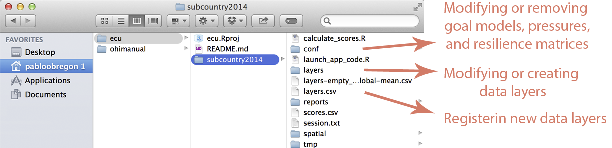

# Using the Toolbox for a Regional Assessment

This page explains how to incorporate all of the pre-Toolbox decisions your team has made for your regional assessment into the OHI framework and your repository. Having a good understanding of how the Toolbox is structured can also help identify what must be modified for a regional assessment, particularly with data and models. This page assumes a good understanding of the Toolbox file system.  

The most common modifications you will make to your repository are:

- **modifying pressures and resilience matrices**
- **modifying and creating data layers for status, trend, pressures and resilience**
- **modifying goal models**
- **removing goals**

These changes are to be made in the following files (see sections below for detailed instructions):

